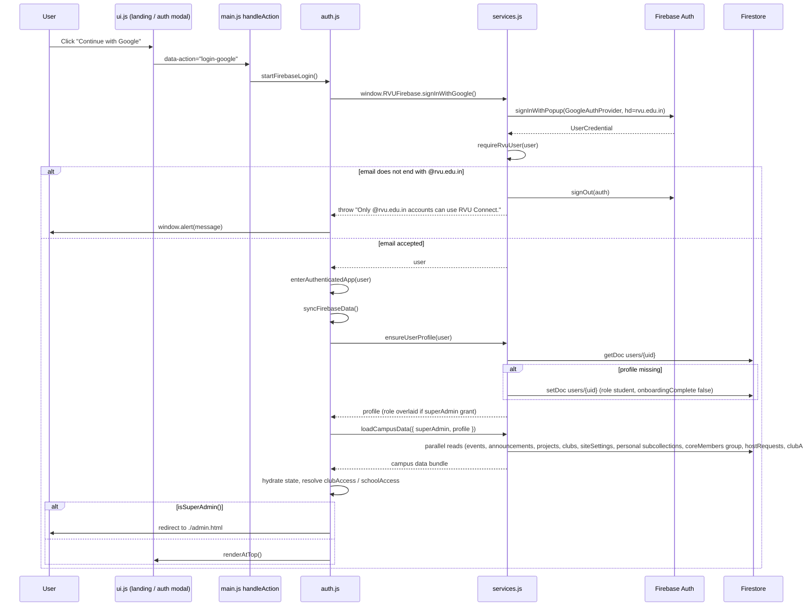
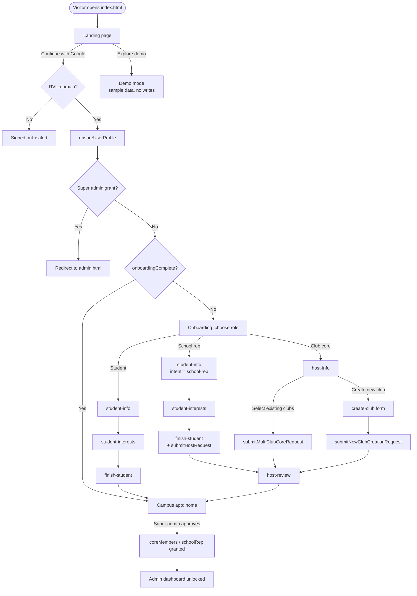
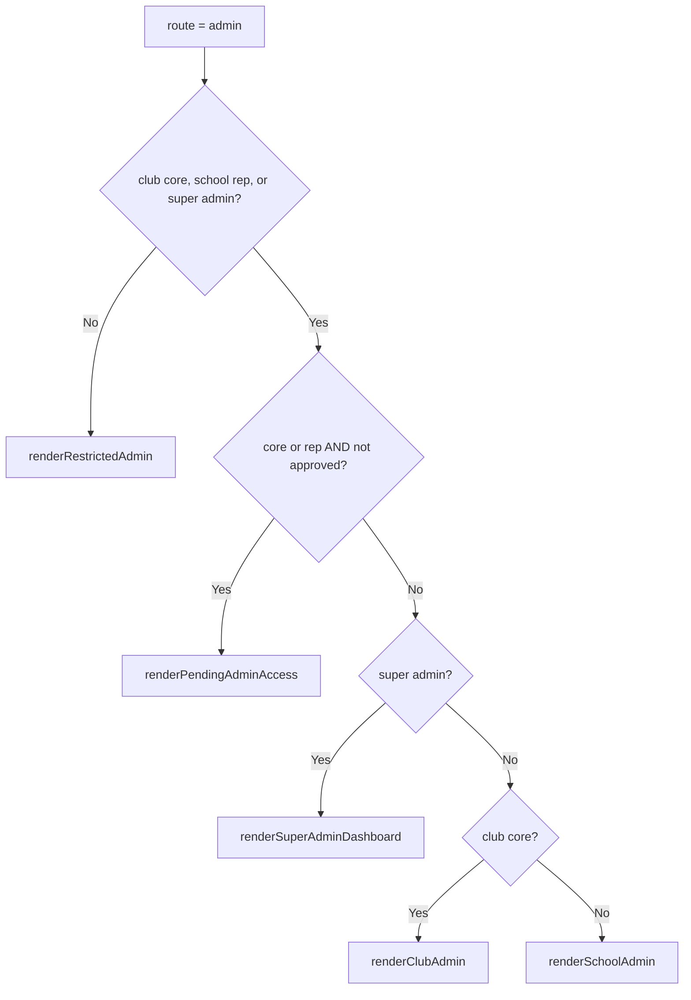
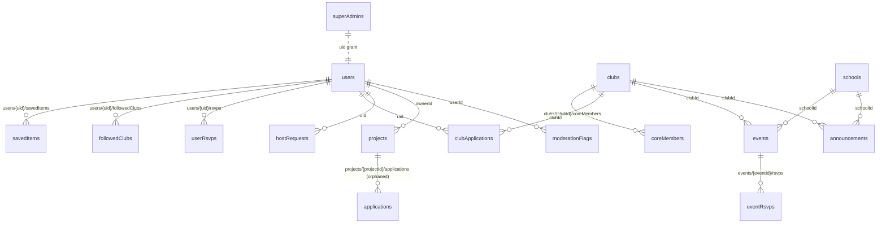
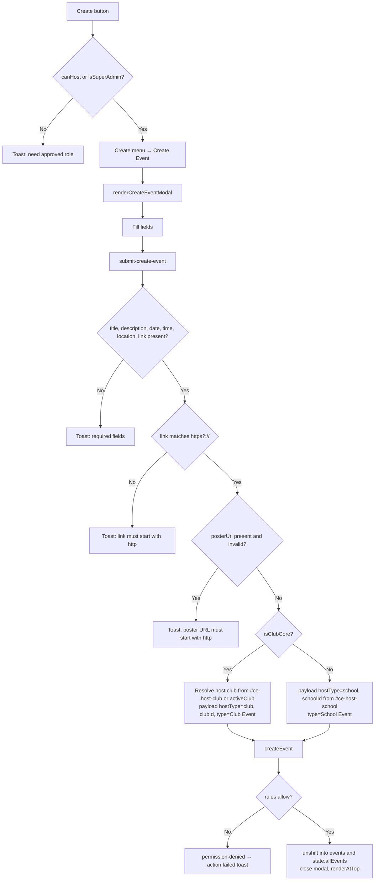
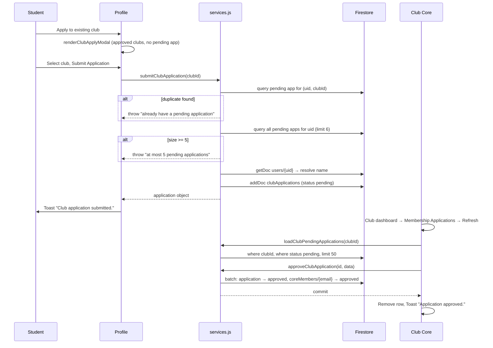
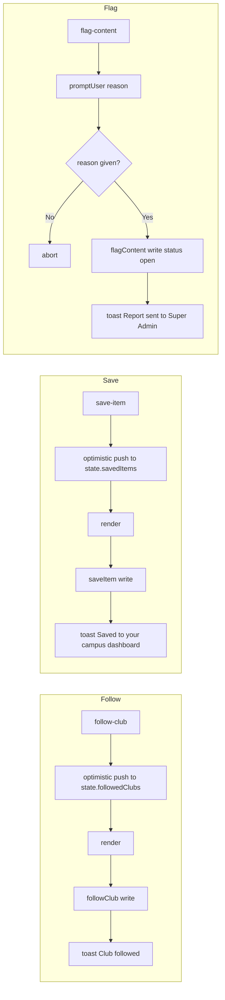
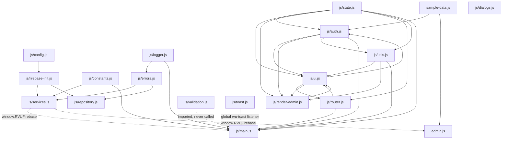

# RVU Connect V1 — Product Documentation

**Status:** Official internal product documentation
**Version:** V1
**Document type:** Reverse-engineered specification (behaviour as built, not as intended)
**Source of truth:** The RVU Connect codebase at `/Users/lenovo/Documents/RVU-Connect-main`
**Analysis date:** 29 July 2026
**Primary artefacts analysed:** `index.html`, `admin.html`, `js/main.js`, `js/ui.js`, `js/services.js`, `js/auth.js`, `js/state.js`, `js/router.js`, `js/render-admin.js`, `js/utils.js`, `js/validation.js`, `js/constants.js`, `js/config.js`, `js/firebase-init.js`, `js/toast.js`, `js/errors.js`, `js/logger.js`, `js/repository.js`, `js/dialogs.js`, `admin.js`, `sample-data.js`, `firestore.rules`, `firestore.indexes.json`

> **Reading contract for this document.** Sections 1–14 and 16 describe *what the product does today*, including behaviour that is incomplete, inconsistent, or dead. No improvements, recommendations, or roadmap items appear in those sections. All defects, gaps, and contradictions are collected in **Section 15 — Known Issues**.

> **Companion artefact.** A Cursor Canvas at `canvases/rvu-connect-v1-product-map.canvas.tsx` is a **section navigator and maturity pulse only**. It does not reproduce the role reference, permission matrix, Firestore schema, button/form catalogues, or workflow diagrams in this file — those remain exclusive to this document.

---

## Table of Contents

1. [Product Overview](#1-product-overview)
2. [Roles and Role Resolution](#2-roles-and-role-resolution)
3. [Authentication and Session Management](#3-authentication-and-session-management)
4. [User Journeys](#4-user-journeys)
5. [Feature Documentation](#5-feature-documentation)
6. [Screens and Routes](#6-screens-and-routes)
7. [Button Catalogue](#7-button-catalogue)
8. [Forms Catalogue](#8-forms-catalogue)
9. [Firestore Data Model](#9-firestore-data-model)
10. [Permission Matrix](#10-permission-matrix)
11. [Workflows](#11-workflows)
12. [Function Interaction Map](#12-function-interaction-map)
13. [Component Relationships](#13-component-relationships)
14. [Current Product Behaviour](#14-current-product-behaviour)
15. [Known Issues](#15-known-issues)
16. [Final Inventories and Maturity Assessment](#16-final-inventories-and-maturity-assessment)

---

## 1. Product Overview

### 1.1 What RVU Connect is

RVU Connect is a digital campus platform ("campus operating system", per the landing copy in `renderLanding()`) built for RV University. It aggregates the four content types that make up campus life — **events**, **clubs**, **announcements**, and **student projects** — into a single authenticated web application, and layers a role-based hosting and approval system on top so that only verified club and school representatives can publish.

Access is restricted to RV University Google accounts. `signInWithGoogle()` in `js/services.js` sets the Google OAuth `hd` (hosted domain) parameter to `rvu.edu.in`, and `requireRvuUser()` re-checks the resolved email against `EMAIL_DOMAIN` (`"@rvu.edu.in"` from `js/constants.js`), signing the user straight back out if the check fails.

### 1.2 Technology profile

| Layer | Implementation |
| --- | --- |
| Front end | Vanilla JavaScript ES modules, no framework, no build step |
| Rendering | String-template rendering into `#app` / `#admin-app` via `innerHTML`, then event re-binding |
| Routing | Query-string routing (`?route=...`) with `history.pushState` — `js/router.js` |
| State | A single mutable module-level object, `state`, in `js/state.js` |
| Auth | Firebase Authentication, Google provider (popup) |
| Database | Cloud Firestore (Firebase JS SDK 12.7.0, loaded from `gstatic.com` CDN) |
| Offline cache | `persistentLocalCache` with `persistentMultipleTabManager` (`js/firebase-init.js`) |
| Abuse protection | Firebase App Check with reCAPTCHA v3, debug token on localhost and non-production Vercel previews |
| Analytics | Firebase Analytics, initialised only when `isSupported()` resolves true |
| Authorization | Firestore Security Rules (`firestore.rules`) as the enforcement boundary; the client applies a second, softer layer |
| Styling | Two hand-written stylesheets (`styles.css`, `admin.css`) plus extensive inline styles in templates |

Firebase project: `rvuconnect-26c39`. Production host allow-listed for App Check: `rvu-connect.vercel.app`.

### 1.3 The two entry points

RVU Connect ships as **two separate web applications sharing one Firebase project**.

```mermaid
graph TB
    subgraph "Campus App — index.html"
        A1[js/toast.js] --> A2[js/services.js]
        A2 --> A3[js/main.js]
        A3 --> A4[js/ui.js + js/render-admin.js]
        A3 --> A5[js/router.js]
        A3 --> A6[js/auth.js]
    end
    subgraph "Super Admin Console — admin.html"
        B1[js/services.js] --> B2[admin.js]
    end
    A2 -.->|window.RVUFirebase| SHARED[(Firebase project<br/>rvuconnect-26c39)]
    B1 -.->|window.RVUFirebase| SHARED
    A6 -->|isSuperAdmin&#40;&#41; → redirect| B2
```



| Entry point | Mounts into | Bootstraps | Audience |
| --- | --- | --- | --- |
| `index.html` | `<div id="app">` | `js/toast.js`, `js/services.js`, `js/main.js` | Guests, demo users, students, club core, school representatives |
| `admin.html` | `<div id="admin-app">` | `js/services.js`, `admin.js` | Super admins only |

`js/services.js` is the shared data-access layer. It attaches every callable operation to `window.RVUFirebase`, and both applications call Firestore exclusively through that global.

Super admins are actively pushed out of the campus app: `enterAuthenticatedApp()` in `js/auth.js` checks `isSuperAdmin()` and, if the current path does not end in `/admin.html`, performs `window.location.href = "./admin.html"`.

### 1.4 Module inventory

| Module | Responsibility |
| --- | --- |
| `js/config.js` | Firebase config, App Check config, a `features` flag block (`applicationsEnabled`, `rsvpEnabled`) |
| `js/firebase-init.js` | Initialises app, App Check, Auth, Firestore (with persistence), Analytics |
| `js/services.js` | All Firestore reads/writes, auth primitives, write tracing, `window.RVUFirebase` surface |
| `js/state.js` | Icons, school list, interest list, the four content arrays, the global `state` object, `defaultClubDraft()` |
| `js/auth.js` | Role predicates, role mapping, data hydration, demo mode, sign-in/sign-out orchestration |
| `js/router.js` | `parseRoute()`, `navigate()`, `renderCurrentRoute()`, `initRouter()` |
| `js/ui.js` | Every campus screen, card, and modal template; `render()` / `renderAtTop()` |
| `js/render-admin.js` | In-app admin dashboards (club core, school rep, super admin) and the admin club-creation page |
| `js/main.js` | Event binding (`bindEvents()`) and the master action dispatcher (`handleAction()`) |
| `js/utils.js` | `promptUser()`, a DOM-based `window.alert` override, `escapeHtml()`, field builders, `validateClubDraft()` |
| `js/validation.js` | `validateEvent`, `validateAnnouncement`, `validateProject` (imported by `main.js` but never called) |
| `js/constants.js` | `ROLES`, `STATUSES`, `ROUTES`, `EMAIL_DOMAIN` |
| `js/toast.js` | Global `rvu-toast` event listener that renders a transient toast element |
| `js/errors.js` | `handleFirebaseError()` error-code → message mapping, plus a `showToast()` helper |
| `js/logger.js` | Thin console wrapper |
| `js/repository.js` | A single generic `getDocument()` helper |
| `js/dialogs.js` | Standalone dialog helpers |
| `admin.js` | The entire standalone super admin console: state, 13 tabs, renderers, action handler, CSV export |
| `sample-data.js` | `applyDemoCampusData()` — seed content for demo mode and for filling gaps in the admin console |

### 1.5 Functional modules of the product

1. **Authentication** — Google-only sign-in gated to the RVU domain.
2. **Onboarding** — a modal wizard that captures role intent, student profile, and interests, and submits host requests.
3. **Home** — personalised digest of upcoming events, updates, and personal activity.
4. **Events** — browse, filter by type, view detail, save, add to Google Calendar; create/edit/cancel for approved hosts.
5. **Clubs** — directory of approved clubs, club detail pages, follow/unfollow, registration toggle for core.
6. **Projects** — student-posted collaboration listings with skills, tags, expiry, external application link.
7. **Announcements** — structured notices from clubs, schools, and the platform.
8. **Profile** — identity, interests, followed clubs, club applications, saved items, role application entry points.
9. **In-app Admin** — three scoped dashboards inside the campus app (club core, school rep, super admin).
10. **Standalone Super Admin console** — 13-tab platform control surface at `admin.html`.
11. **Search** — client-side, in-memory search across all four content types.
12. **Moderation** — user flagging of any content item into a super-admin-only queue.
13. **Demo mode** — a fully navigable, entirely local sample dataset requiring no sign-in.

### 1.6 Product limitations present in V1

These are stated here as current behaviour and expanded in [Section 15](#15-known-issues):

- No push notifications or email notifications of any kind. All user feedback is in-session toasts.
- The **RSVP** button on event cards has no handler; nothing is written when it is clicked.
- **Project applications** are partially built: a subcollection is read by two functions, but nothing writes to it, no security rule covers it, and the update function the admin console calls does not exist.
- Several **filters** are rendered but do not meaningfully narrow results given the shape of the data being written.
- **Email/password authentication** exists in `js/services.js` but no UI reaches it.
- There are **no realtime listeners**; every screen shows a snapshot fetched at load or after an explicit refresh.
- **Two parallel role-string systems** coexist (Firestore `users.role` values versus client `state.role` values).
- Approving a school representative writes `users.role = "schoolRep"`, which is not a value any consumer recognises.
- **Clubs are only readable when `status == "approved"`**, so any club in another state is invisible to non-admins.

---

## 2. Roles and Role Resolution

RVU Connect has six operational roles. Two of them (Guest, Demo Student) are client-only states; four are backed by Firestore.

### 2.1 Role reference

#### Role 1 — Guest (unauthenticated)

| Attribute | Value |
| --- | --- |
| Firestore representation | None |
| Client `state` | `authed: false`, `role: null` |
| Screens available | Landing page only (`renderLanding()`), plus the sign-in modal |
| Capabilities | Start Google sign-in; enter demo mode |
| Data access | None; Firestore rules deny all unauthenticated access |

`render()` in `js/ui.js` returns `renderLanding()` whenever `state.authed` is false, so no campus route can be reached.

#### Role 2 — Demo Student

| Attribute | Value |
| --- | --- |
| Entry | `data-action="preview"` → `enterDemoApp()` in `js/auth.js` |
| Firestore representation | None. `state.authUser` stays `null` |
| Client `state` | `authed: true`, `isDemoMode: true`, `role: "student"` |
| Seed data | `applyDemoCampusData({})` from `sample-data.js`, loaded via `hydrateCampusState()` |
| Identity | Name `"Demo Student"`, school `schools[0]`, year `"2"`, interests `["AI", "Design", "Product", "Web Development"]` |
| Onboarding | Skipped (`state.onboardingStep = null`), lands directly on `home` |
| Capabilities | Full read navigation of every campus screen against sample data |
| Writes | None reach Firebase. Every write path in `handleAction()` is guarded by `if (!window.RVUFirebase ...)` or requires `state.authUser`, and service functions throw `"Sign in first."` when `auth.currentUser` is absent |
| Banner | A persistent dark banner: "⚠ Demo Mode — No data is being saved…" with a **Sign In** button |

#### Role 3 — Student

| Attribute | Value |
| --- | --- |
| Firestore representation | `users/{uid}` with `role: "student"` |
| Client role string | `"student"` |
| Assignment | Default. `ensureUserProfile()` always creates new profiles with `role: "student"`; the security rule on `users` create *requires* `request.resource.data.role == 'student'` |
| Label | "Student" (`roleLabel()`) |
| Screens | Home, Events, Clubs, Projects, Announcements, Profile, Search. `admin` route renders `renderRestrictedAdmin()` |
| Capabilities | Read published content and approved clubs; save items; follow/unfollow clubs; flag content; create/close/delete own projects; edit own profile and interests; apply for club core; apply as school rep; request a new club |

#### Role 4 — Club Core

| Attribute | Value |
| --- | --- |
| Firestore role string | `clubCore` on `users/{uid}` |
| Client role string | `"club-core"` |
| Authoritative permission source | `clubs/{clubId}/coreMembers/{email}` with `status == "approved"` — this is what `isApprovedClubCore(clubId)` in `firestore.rules` checks |
| Label | "Club core" when `state.host.approved`, otherwise "Club pending" |

Three distinct paths produce club core access:

1. **Host request approval** — a `hostRequests` document of `type: "clubCore"` is approved by a super admin. `updateHostRequestStatus()` then writes the `coreMembers` entry and sets `users.role = "clubCore"`.
2. **Club application approval** — a `clubApplications` document is approved by existing core (or a super admin) via `approveClubApplication()`, which batch-writes the application status and the `coreMembers` entry. Note this path does **not** update `users.role`.
3. **New club request approval** — a `hostRequests` document of `type: "newClub"` is approved; the club document is created, the requester is written in as `coreMembers` with role `"President"`, and `users.role` is set to `clubCore`.

At load time `loadCampusData()` runs two `collectionGroup("coreMembers")` queries (by `uid` and by `email`), keeps only entries with `status === "approved"` whose parent club is in the loaded approved-club set, and returns them as `clubAccesses`. `syncFirebaseData()` then overrides `state.role` to `"club-core"` and sets `state.host.approved = true`. Multi-club core membership is supported: `state.host.clubAccesses` may hold several clubs, and the create-event modal offers a host-club selector across them.

#### Role 5 — School Representative

| Attribute | Value |
| --- | --- |
| Firestore role string intended | `schoolRepresentative` (per `ROLES.SCHOOL_REP` and the `roleMap` in `syncFirebaseData()`) |
| Client role string | `"school-rep"` |
| Authoritative permission source | `hostRequests/schoolRepresentative_{uid}` with `status == "approved"` — checked by `isApprovedSchoolRep()` in `firestore.rules` |
| Deterministic document ID | `submitHostRequest()` writes school-rep requests to the fixed ID `schoolRepresentative_${user.uid}` with `{ merge: true }`, so re-application overwrites rather than duplicates |
| Label | "School rep" when approved, otherwise "School pending" |
| Scope | `state.host.school` — one school |

On approval, `updateHostRequestStatus()` writes `users.role = "schoolRep"` and `users.schoolScope = requestData.schoolId`. `"schoolRep"` is not in the `roleMap` used by `syncFirebaseData()`, so the profile role alone resolves to `"student"`; the role only materialises because `loadCampusData()` separately derives `schoolAccess` from the approved `hostRequests` document, and `syncFirebaseData()` then forces `state.role = "school-rep"`.

#### Role 6 — Super Admin

| Attribute | Value |
| --- | --- |
| Firestore role string | `superAdmin` on `users/{uid}`, **or** the existence of `superAdmins/{uid}` |
| Client role string | `"admin"` |
| Detection | `hasSuperAdminGrant(user)` — checks `superAdmins/{uid}` first, then `users/{uid}.role === "superAdmin"`; result memoised in `_cachedSuperAdminResult` and cleared on sign-out |
| Label | "Super admin" |
| Behaviour in campus app | Redirected to `./admin.html` by `enterAuthenticatedApp()` |
| Console | `admin.html` / `admin.js`, 13 tabs |
| Rule power | `isSuperAdmin()` short-circuits nearly every rule in `firestore.rules` |

`ensureUserProfile()` overlays `role: "superAdmin"` onto the returned profile object whenever `hasSuperAdminGrant()` is true, regardless of what the stored `users` document says.

### 2.2 The dual role-string systems

| Context | Student | Club core | School rep | Super admin |
| --- | --- | --- | --- | --- |
| Firestore `users.role` (`ROLES` in `constants.js`) | `student` | `clubCore` | `schoolRepresentative` | `superAdmin` |
| Client `state.role` | `student` | `club-core` | `school-rep` | `admin` |

The bridge is the `roleMap` object inside `syncFirebaseData()`. Anything not in the map falls through to `"student"`.

### 2.3 Role helper functions (`js/auth.js`)

| Function | Returns true when | Used for |
| --- | --- | --- |
| `isClubCore()` | `state.role === "club-core"` | Club dashboard, club-scoped create payloads, Admin nav item |
| `isSchoolRep()` | `state.role === "school-rep"` | School dashboard, school-scoped create payloads, Admin nav item |
| `isSuperAdmin()` | `state.role === "admin"` | Admin gating, redirect to `admin.html`, `canManageCore` |
| `canHost()` | `(isClubCore() \|\| isSchoolRep()) && state.host.approved` | Whether the **Create** button and create actions are available |
| `roleLabel()` | String label including pending states | Profile role badge |
| `activeClub()` | The club matching `state.host.clubSlug`, else `clubs[0]`, else a placeholder object | Club dashboard, club-scoped payloads |

---

## 3. Authentication and Session Management

### 3.1 The only wired sign-in path



The chain in code terms: `login-google` → `startFirebaseLogin()` → `signInWithGoogle()` → `requireRvuUser()` → `enterAuthenticatedApp()` → `syncFirebaseData()` → `ensureUserProfile()` → `loadCampusData()` → `renderAtTop()`.

### 3.2 Email/password functions that exist but are unreachable

`js/services.js` defines and exports `signInWithEmailPassword(email, password)` and `createEmailPasswordAccount(email, password)`. Both validate the domain with `isRvuEmail()` and pass through `requireRvuUser()`. `state` carries `authMode`, `authEmail`, and `authPassword`, `bindEvents()` binds `data-input="authEmail"` and `data-input="authPassword"`, and `handleAction()` implements an `auth-mode` action. However `renderAuthModal()` renders only a Google button and a Cancel button — there are no email, password, or mode-switch controls anywhere in `js/ui.js`, so this entire path is unreachable from the UI.

### 3.3 Session establishment and restoration

`js/services.js` registers `onAuthStateChanged(auth, user => window.dispatchEvent(new CustomEvent("rvu-auth-user", { detail: user })))` at module load.

`js/main.js` listens for `rvu-auth-user` in two places:

- Inside `bindEvents()`, guarded by `window.rvuAuthListenersBound` so it is attached only once across re-renders. It calls `enterAuthenticatedApp(event.detail)` only when `!state.authed`.
- At module top level, unguarded: on a truthy detail it calls `enterAuthenticatedApp()`; on a falsy detail it clears `state.authed`/`state.authUser`, sets `state.role = "student"`, and re-renders.

`js/main.js` also performs a synchronous bootstrap check: if `window.RVUFirebase?.auth?.currentUser` is already set at load, it enters the app immediately; otherwise it clears `dataLoading` and renders. Because Firestore is configured with `persistentLocalCache`, a returning user's session is restored by the Firebase SDK and the app re-enters through this path.

A parallel `rvu-auth-error` listener converts auth errors into toasts.

### 3.4 Profile creation

`ensureUserProfile(user)` reads `users/{uid}`. If it exists, the stored profile is returned (with `role: "superAdmin"` overlaid when a super admin grant is present). If it does not exist, this document is written:

```
{
  email:              user.email,
  name:               user.displayName || user.email.split("@")[0],
  role:               "student",
  clubIds:            [],
  roleTitle:          "",
  interests:          [],
  onboardingComplete: false,
  createdAt:          serverTimestamp(),
  updatedAt:          serverTimestamp()
}
```

A code comment marks the fixed `student` role as temporary pending Cloud Functions. The Firestore rule enforces the same constraint: creating `users/{uid}` requires `role == 'student'`, `email == request.auth.token.email`, and `uid == request.auth.uid`.

### 3.5 Role detection with access overrides

`syncFirebaseData()` derives the role in layers, later layers winning:

1. Map `profile.role` through `roleMap` → `state.role`; unknown values become `"student"`.
2. Copy profile fields into `state.user` and `state.host` (`clubId`, `schoolScope`, `roleTitle`, `hostName`, `hostApproved`).
3. Decide onboarding: if `profile.role === "superAdmin"` or `profile.onboardingComplete`, `state.onboardingStep = null`; otherwise, if no step is set, `state.onboardingStep = "role"`.
4. Load campus data and replace all content collections.
5. **Club access override** — if the profile is not super admin and `data.clubAccess` exists, force `state.role = "club-core"`, populate `state.host.clubAccesses/clubSlug/school/roleTitle/name`, set `approved = true`, and clear onboarding.
6. **School access override** — if the profile is not super admin and `data.schoolAccess` exists, force `state.role = "school-rep"`, set school scope and role title, set `approved = true`, and clear onboarding.

Consequence: membership records outrank the stored profile role. A user whose `users.role` is `"student"` but who has an approved `coreMembers` entry is a fully functional club core in the client, and the Firestore rules agree.

### 3.6 Sign-out

`handleSignOut()` calls `window.RVUFirebase.signOut()` (which also clears `_cachedSuperAdminResult`), then resets `authed`, `authUser`, `role`, `dataLoaded`, `route` (`"home"`), `onboardingStep` (`"role"`), `state.user`, and the four admin arrays, then `renderAtTop()`. Failures surface through the DOM-based `window.alert` override in `js/utils.js`.

In `admin.js`, `sign-out` calls the same service function and then reloads the page.

### 3.7 Domain validation — two implementations

| Function | Location | Actual check |
| --- | --- | --- |
| `isRvuEmail(email)` | `js/services.js` | `email.trim().toLowerCase().endsWith("@rvu.edu.in")` — strict |
| `isAllowedRvuEmail(email)` | `js/auth.js` | `typeof email === "string" && email.trim().includes("@")` — any string containing `@` |
| `isRvuEmail(email)` | `admin.js` | Local copy used by admin form validation |
| `isRvuEmail()` | `firestore.rules` | `request.auth != null && request.auth.token.email is string` — no domain check at all |

`isAllowedRvuEmail()` is what guards the club-creation and leadership forms, and those forms' error toasts read "must end with @rvu.edu.in" even though the check does not test the domain.

---

## 4. User Journeys

### 4.1 Journey map



### 4.2 Guest journey

1. Land on `renderLanding()`. Visible: brand lockup, "For RV University" badge, headline, two CTAs, four "peek" tiles.
2. **Continue with Google** (`login-google`) → Google popup restricted to `rvu.edu.in`, with `prompt: "select_account"`.
3. **Explore demo** (`preview`) → `enterDemoApp()`.
4. `open-login` renders `renderAuthModal()` (Google button + Cancel). The modal is reachable from the demo-mode banner's **Sign In** button.

Failure branches: a non-RVU email is signed out with the message "Only @rvu.edu.in accounts can use RVU Connect."; if `window.RVUFirebase` has not yet loaded, `startFirebaseLogin()` alerts "Firebase is still loading. Please wait a moment and try again."; any other popup error surfaces its message.

### 4.3 Demo Student journey

`enterDemoApp()` → `applyDemoCampusData({})` → `hydrateCampusState(data)` → set demo identity → `state.route = "home"` → `renderAtTop()`.

The demo user can navigate Home, Events (+ detail), Clubs (+ detail), Projects (+ detail), Announcements (+ detail), Profile, and Search. Filters operate on the sample arrays. Actions that require Firebase return early or throw and become toasts. The demo banner persists on every screen via `renderAppShell()`.

### 4.4 Student journey

1. Sign in. Profile is created with `onboardingComplete: false`, so `state.onboardingStep = "role"`.
2. **Onboarding step `role`** — three choice buttons: Student, Club core, School representative (`data-onboard-role`).
3. Choosing **Student** sets `onboardingStep = "student-info"`: name (`data-input="studentName"`), year select, school select.
4. **Continue** (`next-interests`) → `onboardingStep = "student-interests"`: interest chips from the ten-item `interests` list, toggled through `data-interest`.
5. **Explore your campus** (`finish-student`) → `saveUserProfile()` with `{ name, school, year, interests, onboardingComplete: true }` → `onboardingStep = null` → `navigate("home")`.
6. From Home the student reaches Events, Clubs, Projects, Announcements, Profile, and Search through the top nav and bottom nav.

Student-available actions: save items, follow/unfollow clubs, flag content, add events to Google Calendar, create projects, toggle/delete own projects, edit profile and interests, apply for club core, apply as school rep, request a new club.

### 4.5 Club Core journey

**Path A — join existing clubs during onboarding**

1. Onboarding `role` → **Club core**. This sets `state.host.type = "Club Core"`, seeds host fields from `activeClub()`, sets `adminScope = "club"`, `_onboardingIntent = "club-core"`, and moves to `host-info`.
2. `host-info` renders a multi-select checkbox list of all loaded clubs (`multiSelectField("hostClubs", …)`), an **OR** divider, a **Create new club** button, and two text inputs (role title, core display name).
3. **Submit request** (`submit-host`): with zero clubs selected it toasts "Please select at least one club or create a new one." Otherwise `submitMultiClubCoreRequest(selectedClubIds, { name, roleTitle })` writes one `hostRequests` document per club with `type: "clubCore"` and `status: "pending"`.
4. `onboardingStep = "host-review"` and `navigate("home")`. The review modal states the request is under review and that club core can be approved by the current president or a super admin.
5. **Continue to campus** (`close-onboarding`) clears the step and, for club core / school rep, navigates to `admin` — which renders `renderPendingAdminAccess()` while `state.host.approved` is false.
6. A super admin approves the request. On the next sign-in `loadCampusData()` finds the approved `coreMembers` entry (or synthesises access from the approved `hostRequests` row), `syncFirebaseData()` forces `state.role = "club-core"` with `approved = true`, and `renderClubAdmin()` becomes available.

**Path B — create a brand-new club**

1. From `host-info` (or the Profile page) choose **Create new club** (`create-new-club-onboarding`) → `onboardingStep = "create-club"`.
2. Fill the form: club name, category, school select, tagline, description, your role.
3. **Submit for Approval** (`submit-new-club`): name and category are required, otherwise a toast. `submitNewClubCreationRequest(state.clubDraft)` writes a `hostRequests` document with `type: "newClub"`.
4. `state.host.type = "New Club Creation"`, `onboardingStep = "host-review"`, `navigate("home")`.
5. On super admin approval, `updateHostRequestStatus()` slugifies the club name into a document ID, creates `clubs/{slug}` with `status: "approved"`, writes the requester into `coreMembers` with role `"President"`, and sets `users.role = "clubCore"`.

**Path C — apply to an existing club from Profile**

Covered in §4.8.

### 4.6 School Representative journey

**Path A — via onboarding**

1. Onboarding `role` → **School representative**. Sets `host.type = "School Representative"`, `host.name = "Student Representative"`, `host.category = "School"`, `host.approver = "Super Admin"`, `adminScope = "school"`, `_onboardingIntent = "school-rep"`, and — notably — routes to `student-info`, not `host-info`.
2. Complete `student-info` and `student-interests` exactly as a student would.
3. **Explore your campus** (`finish-student`): the profile is saved first, then because `_onboardingIntent === "school-rep"`, `submitHostRequest({ type: "schoolRepresentative", schoolId: state.user.school, name, roleTitle: "Student Representative", description: "Student applying for School Representative role.", approver: "Super Admin" })` is called. `onboardingStep = "host-review"`, then `navigate("home")`.

**Path B — via Profile**

1. Profile → **Apply as School Rep** (`start-school-rep-apply`). If `state.user.school` is empty it toasts "Please select your school in your profile first." Otherwise `renderSchoolRepApplyModal()` opens.
2. The modal requires a free-text reason (`#sr-reason`) and a Yes/No radio confirming a discussion with the Dean / Dean of Student Affairs (`input[name="sr-dean"]`).
3. **Submit Application** (`submit-school-rep-apply`): missing either field toasts "Please provide a reason and confirm dean discussion." Otherwise `submitHostRequest()` is called with the reason as `description` and `deanDiscussed: dean === "Yes"`, then a success toast "School rep application submitted for review."

Both paths write to the same deterministic document `hostRequests/schoolRepresentative_{uid}` with `{ merge: true }`.

**Approval** — a super admin approves; `updateHostRequestStatus()` sets the request to `approved` and writes `users.role = "schoolRep"` plus `users.schoolScope`. The approved request document is what unlocks school-scoped writes in `firestore.rules`, and what `loadCampusData()` uses to build `schoolAccess`. On the next sign-in `renderSchoolAdmin()` becomes available.

### 4.7 Super Admin journey

1. Sign in on `index.html` with an account holding `superAdmins/{uid}` or `users.role === "superAdmin"`.
2. `enterAuthenticatedApp()` detects `isSuperAdmin()` and redirects to `./admin.html`.
3. `admin.js` calls `ensureUserProfile()`, checks `isSuperAdmin()`, and on success runs `loadAdminData()`.
4. `loadAdminData()` calls `loadCampusData({ superAdmin: true })`, fetches live host requests via `loadAdminTab("requests")`, merges the result through `applyDemoCampusData()` so empty registries are backfilled with sample rows, and hydrates `state.data`. It also seeds the Settings form from `siteSettings/platform`.
5. The console renders a left rail with 13 tabs, a summary metric strip, and the active tab body. Tab data for `requests`, `flags`, `users`, `events`, `announcements`, and `review` is lazy-loaded on first visit and cached in `state.loadedAdminTabs`.
6. If the account is signed in but has no grant, `renderDenied()` shows "Not super admin" with Sign out and Open campus app links.

### 4.8 Club application journey (student → club core, approved by club core)

1. Profile → **Apply to existing club** (`open-club-apply-modal`). The button is only rendered when the student has fewer than five pending applications.
2. `renderClubApplyModal()` lists clubs where `status === "approved"` and the student has no pending application. If the eligible list is empty it shows "You have already applied to all available clubs, or have pending applications for each."
3. **Submit Application** (`submit-club-application`) reads `#club-apply-select` and calls `submitClubApplication(clubId)`, which enforces two rules server-side before writing: no existing pending application for the same club ("You already have a pending application for this club."), and at most five pending applications overall ("You can have at most 5 pending Club Core applications at a time."). It resolves the applicant name from `users/{uid}` and writes `{ uid, email, name, clubId, status: "pending", createdAt }`.
4. Optimistic state update, modal closes, toast "Club application submitted." Errors are toasted with `type: "error"`.
5. The student can **Withdraw** a pending application from the Profile list; `withdrawClubApplication()` sets `status: "withdrawn"` after a native `window.confirm`.
6. Club core opens the **Membership Applications** card in `renderClubAdmin()` and presses **Refresh** (`load-club-applicants`) → `loadClubPendingApplications(clubId)`.
7. **Approve** (`approve-club-application`) → `approveClubApplication()` batch-writes the application to `approved` and creates `clubs/{clubId}/coreMembers/{email}` with `role: "core"`, `status: "approved"`, `approvedBy`. **Reject** (`reject-club-application`) confirms, then sets `status: "rejected"`.
8. Either way the row is removed from `state.clubApplicants` and a toast confirms.

### 4.9 Follow, save, and flag journeys

- **Follow a club** — `follow-club` optimistically appends to `state.followedClubs`, re-renders, then `followClub(clubId, clubName)` writes `users/{uid}/followedClubs/{clubId}`; toast "Club followed." **Unfollow** filters state and deletes the document (no toast).
- **Save an item** — `save-item` optimistically appends to `state.savedItems`, then `saveItem({ itemId, type, title })` writes `users/{uid}/savedItems/{type}_{itemId}`; toast "Saved to your campus dashboard." Save buttons appear on event cards, event detail, project cards, project detail, announcement detail, and search-adjacent surfaces.
- **Flag content** — `flag-content` opens the custom `promptUser("Why are you reporting this?")` dialog. Cancelling or submitting empty aborts. Otherwise `flagContent({ collection, targetId, title, reason })` adds a `moderationFlags` document with `status: "open"`, `userId`, `email`; toast "Report sent to Super Admin."

### 4.10 Project creation journey

Any authenticated student opens **Post a project** (`open-create-project`) → `renderCreateProjectModal()` → fills title, description, skills, tags, expiry, contact phone, external application link → **submit-create-project**. Validation: title and description required; the application link, if present, must start with `http://` or `https://`. `createProject()` stamps `ownerId` and `createdBy` from `auth.currentUser.uid`, forces `status` through `requireOneOf(["open","closed"])`, and writes to `projects`. The returned object is unshifted into the local `projects` array and the modal closes.

### 4.11 Event and announcement creation journey (approved hosts)

The **Create** button only renders in the top bar when `canHost() || isSuperAdmin()`. It opens a two-item menu: Create Event, Create Announcement. Both actions re-check `canHost() || isSuperAdmin()` and otherwise toast "You need an approved club core or school representative role to create events." / "…announcements." Full workflows are in [Section 11](#11-workflows).

---

## 5. Feature Documentation

### 5.1 Events

| Aspect | Detail |
| --- | --- |
| Purpose | Publish and discover campus events hosted by clubs or schools |
| Entry points | Bottom/top nav **Events**; Home "This week" cards; Search results; Profile saved items; direct URL `?route=events&eventId=…` |
| Screens | `renderEvents()` (list + filter), `renderEventDetail()` |
| Collections | `events`, subcollection `events/{eventId}/rsvps` |
| Read query | `where("status","==","published")`, `orderBy("createdAt","desc")`, `limit(20)`; paged by `loadMore("events")` using `startAfter` |
| Create | `createEvent(payload)` — stamps `status` (default `published`), `createdBy`, `createdAt`, `updatedAt` |
| Edit | `open-edit-event` → `renderEditEventModal()` → `submit-edit-event` → `updateDocument("events", id, data)` |
| Cancel | `cancel-event` sets a cancelled marker on the event document |
| Delete | `admin-delete-event`, `delete-club-event`, `delete-school-event` → `deleteDocument("events", id)` |
| Publish state | `updateEventStatus(id, "published" \| "draft")` from the super admin surfaces |
| Client validation | Title, description, date, time, location, and external link all required; `link` and `posterUrl` must match `^https?:\/\//` |
| Rules | Create requires `hostType == 'club'` + approved core of `clubId`, or `hostType == 'school'` + approved school rep, or super admin. Update/delete mirror that, with `createdAt` immutable on update |
| Payload shape (club) | `hostType: "club"`, `clubId`, `club`, `host`, `type: "Club Event"`, `tags: [club.category]`, `link`, `linkType`, `posterUrl`, `collaboratingClubs` |
| Payload shape (school) | `hostType: "school"`, `schoolId`, `host`, `type: "School Event"`, `tags: []`, `link`, `posterUrl`, `hostName`, `schoolName` |
| Detail UI | Back link, optional poster image, type chip, CANCELLED / PAST badges, title, host, collaborating clubs, date+time and location block, description, **Join →** external link, **Save**, and a "More from this host" list of up to two other upcoming events by the same host |
| Card UI | Poster or gradient, type, title, host, date, location, **RSVP**, **Save**, **Add to calendar**, **Report** |
| Success | New event unshifted into `events` (and `state.allEvents`), modal closes, re-render |
| Failure | Validation toasts; Firestore errors bubble to the generic action-failure toast |

### 5.2 Announcements

| Aspect | Detail |
| --- | --- |
| Purpose | Structured campus notices — recruitment, registration, information. The screen copy explicitly states "No comments, upvotes, or social clutter." |
| Entry points | Nav **Announcements** / **Updates**; Home updates feed; Search; direct URL |
| Screens | `renderAnnouncements()`, `renderAnnouncementDetail()` |
| Collection | `announcements` |
| Read query | `where("status","==","published")`, `orderBy("createdAt","desc")`, `limit(20)`; `loadMore("announcements")` |
| Create | `createAnnouncement(payload)` |
| Edit | `edit-announcement` → `renderEditAnnouncementModal()` → `submit-edit-announcement` |
| Delete | `admin-delete-announcement`, `delete-club-announcement`, `delete-school-announcement` |
| Status | `updateAnnouncementStatus(id, "published" \| "draft")` |
| Client validation | Title and description required; `link` and `imageUrl` must match `^https?:\/\//` |
| Tag | Radio group `input[name="ca-tag"]`, defaulting to `"Notice"` |
| Source shaping | Club core → `source: club.name`, `sourceType: "club"`, `type: "Club"`, `clubId`. School rep → `source`/`schoolId`/`schoolName` from the school select, `sourceType: "school"`, `type: "School"`, `hostName`. Super admin → `source: "RVU"`, `sourceType: "admin"`, `type: "School"` |
| Rules | Create requires `sourceType == 'club'` + approved core, `sourceType == 'school'` + approved school rep, or super admin. `sourceType: "admin"` is only writable by super admin, since it satisfies neither of the first two branches |
| Detail UI | Back link, tag chip, title, source, time, optional image, body, optional external link, **Save**, **Report** |

### 5.3 Clubs

| Aspect | Detail |
| --- | --- |
| Purpose | Authoritative directory of approved campus clubs |
| Entry points | Nav **Clubs**; club names on events/announcements; Search; Profile followed list; `?route=clubs&clubSlug=…` |
| Screens | `renderClubs()`, `renderClubDetail()` |
| Collections | `clubs`, subcollection `clubs/{clubId}/coreMembers` |
| Read query | `where("status","==","approved")`, `limit(100)` — plus `limit(100)` over all clubs for super admins |
| Visibility rule | `clubs` read requires `status == 'approved'`, or super admin, or approved core of that club. Pending/rejected clubs are invisible to everyone else |
| Create | Super admin only: `createClub(payload)` from the in-app **Create a club** page or the console **Clubs** tab. Also created indirectly by approving a `newClub` host request |
| Update | `updateClub()`, `updateClubProfile()`, `updateClubLeadership()`, `updateClubRegistration()` |
| Delete | Super admin only: `deleteDocument("clubs", id)` |
| Core roster | `assignClubCoreRole(clubId, { email, name, role })`, `removeClubCoreRole(clubId, email)` |
| Registration toggle | `toggle-registration` optimistically flips `club.registrationOpen`, calls `updateClubRegistration()`, and rolls the value back and re-renders if the write throws |
| Filters | Category and School selects, both derived from the loaded club set; both filter correctly |
| Detail UI | Hero with name/category/school/tagline, description, "what they do", highlights, registration state, join link, upcoming and past events, **Follow**, **Report** |
| Rules note | Approved core may update the club document but not `createdAt` or `createdBy` |

### 5.4 Projects

| Aspect | Detail |
| --- | --- |
| Purpose | Student-to-student collaboration listings |
| Entry points | Nav **Projects**; Home personalised cards; Search; `?route=projects&projectId=…` |
| Screens | `renderProjects()`, `renderProjectDetail()`, `renderCreateProjectModal()` |
| Collections | `projects`; a `projects/{projectId}/applications` subcollection is read by `getProjectApplicants()` but never written by the product |
| Read query | `orderBy("createdAt","desc")`, `limit(20)`; `loadMore("projects")` |
| Create | `createProject(payload)` — any authenticated RVU user |
| Owner controls | `toggle-project-status` (open ↔ closed), `delete-own-project` |
| Ownership test in UI | `project.postedBy === state.authUser?.email || isSuperAdmin()` |
| Ownership test in rules | `resource.data.ownerId == request.auth.uid` |
| Fields | `title`, `description`, `skills[]`, `tags[]`, `expiry`, `contactPhone`, `applicationLink`, `postedBy`, `postedByName`, `status`, `score`, `ownerId`, `createdBy`, timestamps |
| Filter | Tag select built from the union of all loaded project tags; filters correctly |
| Applying | If `applicationLink` is set, an **Apply / Join Project ↗** anchor opens it in a new tab. If not, the detail page shows "Contact the owner directly to collaborate." There is no in-product application record |
| Contact gating | Poster email and phone render only when `state.authUser` is truthy; otherwise "Sign in to see contact details." |
| Rules | Read by any signed-in user; create requires `ownerId == uid` and `status in ['open','closed']`; update/delete by owner or super admin, with `ownerId` and `createdAt` immutable |

### 5.5 Profile

| Aspect | Detail |
| --- | --- |
| Purpose | Personal identity, activity, and role-application hub |
| Entry point | Nav **Profile** (`data-route="profile"`) |
| Screen | `renderProfile()` |
| Header | Two-letter initials avatar, name, gold role badge from `roleLabel()`, school, year |
| Sections | Recent Activity (derived from RSVPs and follows), My Interests, Clubs I Follow, My Club Applications, Saved Items |
| Buttons | **Edit Profile**, **Edit Interests**, **Apply to existing club**, **Create new club**, **Apply as School Rep** |
| Conditional rendering | The two club buttons render only while pending club applications number fewer than five |
| Modals | `renderEditProfileModal()`, `renderProfileInterestsModal()`, `renderClubApplyModal()`, `renderSchoolRepApplyModal()` |
| Edit Profile | Name (`#ep-name`, required, non-empty), school select (`#ep-school`), year via `ep-year` buttons → `updateUserProfile(uid, { name, school, year })` (aliased to `saveUserProfile`) |
| Edit Interests | Chip toggles; closing the modal fires `saveUserProfile(uid, { interests })` with errors swallowed (`.catch(() => {})`) |
| Writable fields | `saveUserProfile()` passes data through `pickFields(["name","school","year","interests","onboardingComplete","clubIds"])`, so `role` and `email` can never be changed from this path — matching the rule that requires both to be `unchanged` |
| Followed clubs rows | **View →** (`open-club`) and **Unfollow** |
| Club application rows | Status badge (green approved / red rejected / grey pending) and **Withdraw** for pending rows |
| Saved item rows | Type badge and **View →** using `data-action="open-{type}-detail"` |

### 5.6 In-app Admin Dashboards

`renderAdminConsole()` in `js/render-admin.js` gates as follows:



**`renderRestrictedAdmin()`** — a static "Admin access" panel stating that students cannot switch themselves into admin roles from the client.

**`renderPendingAdminAccess()`** — shows the pending scope, approver route, requested role title, description, and a checklist: cannot create events until approved, cannot post announcements until approved, can be approved by super admin.

**`renderClubAdmin()`** — summary strip (club event count, registration state, your role title) plus cards:
- *Club* — **Create club event**, **Create update**, **Open/Close registration**, **Manage links** (a `toast` placeholder reading "Link visibility controls are ready for …").
- *Links* — read-only checklist of join link, registration state, and visibility scope.
- *Host* — up to four club events and announcements, each with **Delete**.
- *Apply* — **Membership Applications** with a **Refresh** button, then pending applicants with **Approve** / **Reject**.
- *Core* — **Core approval**. Leadership and core-role buttons render only when `canManageCore`, which is defined as `isSuperAdmin()`. Below that, pending `clubCore` host requests for this club with Approve/Reject rows.
- *Limits* — a static permission-boundary checklist.

**`renderSchoolAdmin()`** — summary strip (school scope, school/faculty event count, posting Enabled/Locked) plus cards: *Scope* with **Create school event** and **Create school notice**; *Links*; *Notice* (up to three school announcements with **Delete**); *Events* (up to three school events with **Delete**); *Rules* (static limits, including "Cannot approve club core members").

**`renderSuperAdmin()`** — an in-app tabbed super admin surface (requests, users, schools, clubs, …). In practice super admins are redirected to `admin.html` before they can reach it.

### 5.7 Standalone Super Admin Console (`admin.html` + `admin.js`)

Thirteen tabs in the left rail:

| Tab | Title | Contents and actions |
| --- | --- | --- |
| `overview` | Command Center | Metrics and quick-jump buttons to other tabs |
| `requests` | Host Requests | All `hostRequests` with **Approve** / **Reject** (`approve-request`, `reject-request`) |
| `clubs` | Club Registry | Create-club form (`create-club`), club profile editor (`update-club-profile`), `reset-club`, per-club **Leadership** (`club-leadership`), **Assign core** (`club-core`), **Remove core** (`remove-core`), **Delete** |
| `schools` | School Registry | `create-school`, `delete-school` |
| `events` | Event Control | `create-event`, `publish-event`, `unpublish-event`, `delete-event`, `export-rsvps` |
| `announcements` | Notice Control | `create-announcement`, `unpublish-announcement`, `delete-announcement` |
| `projects` | Project Control | `create-project`, `delete-project`, `project-application-status`, `export-project-applicants` |
| `review` | Review Queue | `create-review`, `approve-review`, `reject-review` |
| `roles` | Role Manager | `grant-role` via `grantPlatformRole({ email, uid, role })` |
| `settings` | Site settings | `save-settings` → `updateSiteSetting("platform", …)` |
| `analytics` | Analytics | Computed cards over loaded data |
| `users` | Users | User rows, `export-users` CSV, `toggle-suspend-user` (explicitly a no-op: "Legacy action ignored") |
| `moderation` | Moderation | `moderationFlags` queue |

Console mechanics: `promptUser()` is reimplemented locally as a DOM modal; `showToast()` sets `state.toast` and re-renders; `downloadCSV()` builds and clicks a blob link; `refresh()` reloads admin data; tab data is lazily fetched via `loadAdminTab(tab)` and paged with `load-more-admin-tab` using `state.adminCursors`; `render()` is wrapped in a try/catch that paints an "Admin Panel Error" panel with a Reload App button.

### 5.8 Club Applications

Purpose: let a student request core membership of an existing approved club, reviewed by that club's core. Collection `clubApplications`, statuses `pending` → `approved` | `rejected` | `withdrawn`. Constraints: no duplicate pending application per club; at most five pending applications per student; the apply modal additionally filters out clubs with an existing pending application. Functions: `submitClubApplication`, `withdrawClubApplication`, `loadClubPendingApplications`, `approveClubApplication`, `rejectClubApplication`. Rules: create requires self-owned `uid`, matching `email`, and `status == 'pending'`; read by owner, approved core of `clubId`, or super admin; update by super admin, by the owner strictly for `pending → withdrawn`, or by approved core; delete by super admin only.

### 5.9 School Representative Applications

Purpose: request authority to publish school-wide events and notices. Stored in `hostRequests` with `type: "schoolRepresentative"` at the deterministic ID `schoolRepresentative_{uid}`. Two entry points (onboarding intent and the Profile modal). Approval is super-admin-only. The approved request document is itself the permission record consulted by `isApprovedSchoolRep()` in the rules.

### 5.10 New Club Requests

Purpose: let a student propose a club that does not exist yet. Stored in `hostRequests` with `type: "newClub"` carrying `clubName`, `clubCategory`, `clubSchool`, `clubDescription`, `clubTagline`, `founderName`, `founderEmail`, `roleTitle`. Approval creates `clubs/{slug}` (slug derived from the club name by lowercasing and replacing non-alphanumerics with hyphens) with `status: "approved"`, writes the requester into `coreMembers` as `President`, and sets `users.role = "clubCore"`. Entry points: the onboarding `create-club` step and the Profile **Create new club** button.

### 5.11 Saved Items

Purpose: a personal bookmark list. Path `users/{uid}/savedItems/{type}_{itemId}` with `{ itemId, type, title, createdAt }`. Written by `saveItem()`, read by `loadCampusData()` (`limit(50)`), displayed in the Profile **Saved Items** section. Fully self-scoped in the rules. There is no un-save action in the UI — the `savedItems` document, once written, is not removable from the product.

### 5.12 RSVPs

RSVP is **modelled but not writable**. Two storage locations are declared in `firestore.rules`: `users/{uid}/rsvps/{eventId}` (self-owned read/write) and `events/{eventId}/rsvps/{uid}` (self-owned write, readable by owner or super admin). `loadCampusData()` reads `users/{uid}/rsvps` with `limit(50)` and the Profile page renders an RSVP list and RSVP-derived "Recent Activity" entries. `getEventRSVPs(eventId)` reads the event-side subcollection and powers the console **Export RSVPs** CSV. `renderEventCard()` renders an **RSVP** button with `data-action="rsvp-event"`, but `handleAction()` in `js/main.js` has no `rsvp-event` branch. Clicking it falls through to the trailing `renderAtTop()` and nothing is persisted. `CONFIG.features.rsvpEnabled` is `true` but is never read by any module.

### 5.13 Search

Client-side only, over the already-loaded in-memory arrays. Opened with `toggle-search` from the top bar; `renderSearchOverlay()` covers the viewport with a search input (`#search-input`, `data-action="search-input"`) and a results container. Input handling is bound once (`window.rvuSearchInputBound`) on the `#app` element; on each keystroke `state.searchQuery` updates and only `#search-results-container` is re-rendered and re-bound, keeping focus. The click handler for `data-action` explicitly skips `search-input` so typing does not fire an action.

`renderSearchResultsHtml()` requires more than one character (`q.length > 1`) and matches case-insensitively:

| Group | Fields searched | Cap |
| --- | --- | --- |
| Events | `title`, `description`, `host` | 5 |
| Clubs | `name`, `description`, `category` | 4 |
| Projects | `title`, `description`, joined `tags` | 4 |
| Announcements | `title`, `description`, `source` | 3 |

Empty query → "Start typing to search across RVU Connect". No matches → `No results for "…"`. Selecting a result (`search-open-event`, `search-open-club`, `search-open-project`, `search-open-announcement`) closes the overlay, clears the query, and navigates to the corresponding detail view.

### 5.14 Filters

Five filter keys live in `state.filters`. Filters bind through `data-filter` in `bindEvents()`, which writes the value into `state.filters` only when the key already exists on the object, then re-renders.

| Filter | Screen | Options | Compared against | Effective? |
| --- | --- | --- | --- | --- |
| `eventType` | Events | All, Club Event, School Event | `event.type` | Yes — create paths write exactly these strings |
| `clubCategory` | Clubs | All + distinct loaded `club.category` | `club.category` | Yes |
| `clubSchool` | Clubs | All + distinct loaded `club.school` | `club.school` | Yes |
| `projectTag` | Projects | All + union of loaded `project.tags` | `project.tags.includes(...)` | Yes |
| `announcementType` | Announcements | All, Club, School | `item.type` | Partially — club and school announcements do set `type` to `"Club"`/`"School"`, but super-admin announcements are written with `type: "School"` and `sourceType: "admin"`, and demo/legacy rows may carry other `type` values such as `"Faculty"`, which no option can select |

Other filter-shaped keys bound in `bindEvents()` (`studentSchool`, `studentYear`, `hostClub`, `hostSchool`, `hostApprover`) are form inputs, not list filters, and write into `state.user` / `state.host` instead.

### 5.15 Notifications

There is no notification system. The only feedback channels are:

1. **Toasts** — `window.dispatchEvent(new CustomEvent("rvu-toast", { detail: { message, type } }))`, rendered by `js/toast.js` as a fixed bottom-centre element, green for anything other than `"error"` and red for `"error"`, fading out after 3 seconds. `js/errors.js` exposes the same mechanism as `showToast()`.
2. **The DOM `window.alert` override** in `js/utils.js` — a blocking gold-button modal used for auth and load failures.
3. **`promptUser()`** — a custom single-input modal used for flag reasons and admin prompts.
4. **Native `window.confirm`** — used before withdrawing an application, rejecting an application, and deleting a project.
5. **Badge counts** — `navButtons()` renders a red numeric badge on the Admin nav item: pending host request count for super admins, or pending `clubCore` requests scoped to the user's clubs for approved club core.

No push notifications, no service worker, no email, no in-app inbox.

### 5.16 Settings

Platform settings live in `siteSettings` (document `platform`) and are edited only from the console **Settings** tab. Fields: `eventCategories`, `interestTags`, `announcementTags`, `bannedWords` (all comma-separated in the form, stored as arrays), and `reviewRequired` (boolean). Written by `updateSiteSetting(settingId, data)`. Read by every signed-in user (`loadCampusData()` loads the whole collection into `state.siteSettings`), but the campus app does not consume any of these values — event categories, interest tags, and announcement tags in the campus UI come from hard-coded arrays in `js/state.js` and from the literal option lists in the modals.

### 5.17 Modal inventory

| Modal | Renderer | Opened by |
| --- | --- | --- |
| Auth / Sign in | `renderAuthModal()` | `open-login` |
| Onboarding: role | `renderOnboarding()` step `role` | `state.onboardingStep === "role"` |
| Onboarding: student info | step `student-info` | `data-onboard-role="student"` / `"school-rep"` |
| Onboarding: interests | step `student-interests` | `next-interests` |
| Onboarding: host info | step `host-info` | `data-onboard-role="club-core"`, `back-to-host-info` |
| Onboarding: create club | step `create-club` | `create-new-club-onboarding` |
| Onboarding: host review | step `host-review` | `submit-host`, `submit-new-club`, `finish-student` (school-rep intent), `host-review` |
| Create Event | `renderCreateEventModal()` | `create-event` |
| Edit Event | `renderEditEventModal()` | `open-edit-event` |
| Create Announcement | `renderCreateAnnouncementModal()` | `create-announcement` |
| Edit Announcement | `renderEditAnnouncementModal()` | `edit-announcement` |
| Create Project | `renderCreateProjectModal()` | `open-create-project` |
| Edit Profile | `renderEditProfileModal()` | `edit-profile` |
| Profile Interests | `renderProfileInterestsModal()` | `edit-interests` / `open-profile-interests` |
| Club Apply | `renderClubApplyModal()` | `open-club-apply-modal` |
| School Rep Apply | `renderSchoolRepApplyModal()` | `start-school-rep-apply` |
| Search overlay | `renderSearchOverlay()` | `toggle-search` |
| Generic prompt | `promptUser()` in `js/utils.js` | Flag reason, admin prompts |
| Generic alert | `window.alert` override in `js/utils.js` | Auth and load failures |

The four create/edit modals and the search overlay are rendered from `renderAppShell()`, so they persist across route changes. The four profile modals are rendered from inside `renderProfile()` and therefore exist only on the Profile route.

---

## 6. Screens and Routes

### 6.1 Route table (campus app)

Routing is query-string based: `?route=<name>` with optional `eventId`, `projectId`, `announcementId`, `clubSlug`.

| Route | Renderer | Access | URL parameters |
| --- | --- | --- | --- |
| *(unauthenticated)* | `renderLanding()` | Guest | — |
| `home` | `renderHome()` | Any authenticated / demo user | — |
| `events` | `renderEvents()` → `renderEventDetail()` | Any | `eventId` |
| `clubs` | `renderClubs()` → `renderClubDetail()` | Any | `clubSlug` |
| `projects` | `renderProjects()` → `renderProjectDetail()` | Any | `projectId` |
| `announcements` | `renderAnnouncements()` → `renderAnnouncementDetail()` | Any | `announcementId` |
| `profile` | `renderProfile()` | Any | — |
| `admin` | `renderAdminConsole()` | Gated four ways (restricted / pending / club / school / super) | — |
| `admin-create-club` | `renderCreateClubPage()` | Super admin only, else `renderRestrictedAdmin()` | — |
| *(anything else)* | `renderHome()` | Any | — |

`renderRoute()` short-circuits to `renderLoadingState()` (a shimmering skeleton) whenever `state.dataLoading` is true.

### 6.2 Navigation chrome

`renderAppShell()` assembles: top bar (brand lockup, desktop nav, search button, conditional **Create** button, **Sign Out**), marquee ticker, demo banner when applicable, `<main>` with the routed screen, footer, bottom nav, then the persistent modals.

`navButtons()` renders Home, Events, Clubs, Projects, Announcements (labelled "Updates" in the icon variant), then **Admin** only when `isClubCore() || isSchoolRep()`, then Profile. Super admins do not receive an Admin nav item in the campus app because they are redirected to `admin.html`.

### 6.3 Sub-screens and overlay states

Detail views are not separate routes; they are selection states within a route. `renderHome()` itself intercepts `state.selectedEventId` and `state.selectedProjectId`, and `renderClubs()` intercepts `state.selectedEventId`, so a detail view can be reached from more than one route. `navigate()` clears every selection id that does not belong to the target route and closes the create menu before pushing history.

`initRouter()` registers a `popstate` handler that restores route and selection ids from `event.state` (or re-parses the URL) and re-renders without pushing new history.

### 6.4 Console screens (`admin.html`)

| Screen | Renderer | Condition |
| --- | --- | --- |
| Loading | inline in `render()` | `state.loading` |
| Login | `renderLogin()` | No signed-in user |
| Access denied | `renderDenied()` | Signed in without a super admin grant |
| Console shell + tab | `renderRail()` + `renderSummary()` + `renderTab()` | Super admin |
| Error panel | inline catch in `render()` | Any exception thrown during render |

---

## 7. Button Catalogue

Every interactive control in the campus app is a `data-action` (dispatched through `handleAction()`) or a `data-route` (dispatched through `navigate()`). `bindEvents()` disables a button (`pointerEvents: none`, `opacity: 0.5`) for the duration of its async handler and restores the original styles in `finally`, so double-submission is prevented per click.

### 7.1 Authentication and session

| Button | Action | Effect |
| --- | --- | --- |
| Continue with Google | `login-google` | `startFirebaseLogin()` |
| Explore demo | `preview` | `enterDemoApp()` |
| Sign In (demo banner) | `open-login` | Opens auth modal |
| Cancel (auth modal) | `close-login` | Closes modal, clears `authPassword` |
| Sign Out | `sign-out` | `handleSignOut()` |
| *(no UI trigger)* | `auth-mode` | Would set `state.authMode`; no control renders it |

### 7.2 Onboarding

| Button | Action / attribute | Effect |
| --- | --- | --- |
| Student / Club core / School representative | `data-onboard-role` | Sets intent and next step |
| Continue | `next-interests` | → `student-interests` |
| Interest chips | `data-interest` | Toggles interest |
| Explore your campus | `finish-student` | Saves profile; submits school-rep request when intent matches |
| Create new club | `create-new-club-onboarding` | → `create-club` |
| Back | `back-to-host-info` | → `host-info` |
| Submit for Approval | `submit-new-club` | `submitNewClubCreationRequest()` |
| Submit request | `submit-host` | `submitMultiClubCoreRequest()` |
| Continue to campus | `close-onboarding` | Clears step; navigates to `admin` for core/rep |
| *(programmatic)* | `host-review` | Sets step to `host-review` |

### 7.3 Content creation and editing

| Button | Action | Guard |
| --- | --- | --- |
| Create (top bar) | `toggle-create` | Rendered only when `canHost() \|\| isSuperAdmin()` |
| Create Event | `create-event` | Re-checks `canHost() \|\| isSuperAdmin()` |
| Create Announcement | `create-announcement` | Same |
| Post a project | `open-create-project` | Any authenticated user |
| Publish / Submit (event) | `submit-create-event` | Field validation |
| Publish / Submit (announcement) | `submit-create-announcement` | Field validation |
| Create project | `submit-create-project` | Field validation |
| Save changes (event) | `submit-edit-event` | Field validation |
| Save changes (announcement) | `submit-edit-announcement` | Field validation |
| Cancel event | `cancel-event` | Host or super admin |
| Edit (event) | `open-edit-event` | Host or super admin |
| Edit (announcement) | `edit-announcement` | Host or super admin |
| Close buttons | `close-create-event`, `close-edit-event`, `close-create-announcement`, `close-edit-announcement`, `close-create-project` | — |

### 7.4 Content interaction

| Button | Action | Effect |
| --- | --- | --- |
| **RSVP** | `rsvp-event` | **No handler exists.** Falls through to `renderAtTop()`; nothing is written |
| Save | `save-item` | Optimistic append + `saveItem()` + toast |
| Add to calendar | `calendar-event` | Opens a Google Calendar `TEMPLATE` URL in a new tab with encoded title, details, location |
| Report | `flag-content` | `promptUser()` for a reason, then `flagContent()` + toast |
| Follow | `follow-club` | Optimistic append + `followClub()` + toast |
| Unfollow | `unfollow-club` | Optimistic filter + `unfollowClub()` |
| Open club | `open-club` | `navigate("clubs", { clubSlug })` |
| Back to clubs | `back-to-clubs` | Clears `selectedClubSlug` |
| Open detail | `open-event-detail`, `open-project-detail`, `open-announcement-detail` | Sets selection id and re-renders at top |
| Close detail | `close-event-detail`, `close-project-detail`, `close-announcement-detail` | Clears selection id |
| Load more | `load-more` | `loadMore(collection)` and appends |
| Close project (owner) | `toggle-project-status` | Flips `open` ↔ `closed` |
| Delete project (owner) | `delete-own-project` | Confirms, then deletes |

### 7.5 Search

| Button | Action |
| --- | --- |
| Search (top bar) | `toggle-search` |
| Close | `close-search` |
| Search field | `search-input` (input event only; click is explicitly ignored) |
| Result rows | `search-open-event`, `search-open-club`, `search-open-project`, `search-open-announcement` |

### 7.6 Profile

| Button | Action | Notes |
| --- | --- | --- |
| Edit Profile | `edit-profile` | Opens modal |
| Save (profile) | `submit-edit-profile` | Requires non-empty name |
| Year selector | `ep-year` | Sets `state.user.year` |
| Close (profile) | `close-edit-profile` | — |
| Edit Interests | `edit-interests` | Alias of `open-profile-interests` |
| Save Interests / Cancel | `close-profile-interests` | **Both** buttons run the same handler, which persists interests — Cancel saves |
| Apply to existing club | `open-club-apply-modal` | Rendered only when pending applications < 5 |
| Create new club | `create-new-club-onboarding` | Same condition |
| Apply as School Rep | `start-school-rep-apply` | Requires a school on the profile |
| Submit Application (club) | `submit-club-application` | — |
| Withdraw | `withdraw-club-application` | Native confirm |
| Submit Application (school rep) | `submit-school-rep-apply` | Requires reason + dean radio |
| Close modals | `close-club-apply-modal`, `close-school-rep-apply-modal` | — |
| *(no UI trigger)* | `go-profile` | Handler exists; no control renders it |

### 7.7 In-app admin

| Button | Action | Role |
| --- | --- | --- |
| Approve / Reject request | `approve-host`, `reject-host` | Super admin (rules), rendered in club core Core card |
| Open/Close registration | `toggle-registration` | Club core |
| Manage links | `toast` (placeholder message) | Club core |
| Refresh applicants | `load-club-applicants` | Club core |
| Approve / Reject application | `approve-club-application`, `reject-club-application` | Club core, super admin |
| Update leadership | `club-update-leadership` | Rendered only when `canManageCore` (`isSuperAdmin()`) |
| Assign / Remove core role | `club-assign-core`, `club-remove-core` | Same condition |
| Delete club content | `delete-club-event`, `delete-club-announcement` | Club core |
| Delete school content | `delete-school-event`, `delete-school-announcement` | School rep |
| Admin tabs | `admin-tab` | Super admin |
| Create a club | `admin-create-club` | Super admin |
| Create club (submit) | `admin-submit-club` | Super admin, `validateClubDraft()` |
| Clear form / Back | `admin-reset-club-form`, `admin-back-to-clubs` | Super admin |
| Create school / Delete school | `admin-create-school`, `admin-delete-school` | Super admin |
| Assign / Remove core | `admin-assign-core`, `admin-remove-core` | Super admin |
| Update leadership | `admin-update-club-leadership` | Super admin |
| Delete club | `admin-delete-club` | Super admin |
| Create event / announcement | `admin-create-event`, `admin-create-announcement` | Super admin |
| Publish / Unpublish | `admin-publish-event`, `admin-unpublish-event`, `admin-unpublish-announcement` | Super admin |
| Delete content | `admin-delete-event`, `admin-delete-announcement`, `admin-delete-project` | Super admin |
| Generic toast | `toast` | Placeholder messaging |

### 7.8 Console buttons (`admin.js`)

`login-google`, `sign-out`, `refresh`, `approve-request`, `reject-request`, `create-club`, `update-club-profile`, `reset-club`, `club-leadership`, `club-core`, `remove-core`, `delete-club`, `create-school`, `delete-school`, `create-event`, `publish-event`, `unpublish-event`, `delete-event`, `create-announcement`, `unpublish-announcement`, `delete-announcement`, `create-project`, `delete-project`, `project-application-status`, `create-review`, `approve-review`, `reject-review`, `grant-role`, `save-settings`, `export-users`, `export-rsvps`, `export-project-applicants`, `toggle-suspend-user` (no-op), `load-more-admin-tab`, plus 13 `data-tab` navigation buttons.

---

## 8. Forms Catalogue

### 8.1 Onboarding — Student Info

| Field | Binding | Type | Required |
| --- | --- | --- | --- |
| Name | `data-input="studentName"` | text | Enforced later by profile edit, not here |
| Year | `data-filter="studentYear"` | select 1–4 | Defaults `"1"` |
| School | `data-filter="studentSchool"` | select of nine schools | Defaults `schools[0]` |

Submit: **Continue** (`next-interests`).

### 8.2 Onboarding — Interests

Ten chips: AI, Web Development, Design, Business, Finance, Marketing, Product, Film, Law, Healthcare. Toggled via `data-interest`. Submit: **Explore your campus** (`finish-student`) → `saveUserProfile()` with `onboardingComplete: true`.

### 8.3 Onboarding — Host Info (club core)

| Field | Binding | Notes |
| --- | --- | --- |
| Select Clubs | `data-multi-select="hostClubs"` | Checkbox list of loaded clubs; pushes/removes ids in `state.host.selectedClubIds`. Shows "No approved clubs available." when empty |
| Role (for selected clubs) | `data-input="hostRoleTitle"` | Defaults `"Core Member"` |
| Core display name | `data-input="hostName"` | Seeded from `activeClub().name` |

Validation: at least one club selected, else "Please select at least one club or create a new one." Submit: `submit-host`.

### 8.4 Onboarding — Create Club

| Field | Binding | Required |
| --- | --- | --- |
| Club Name | `data-club-input="name"` | Yes |
| Category | `data-club-input="category"` | Yes |
| School Affiliation | `data-club-input="school"` (select) | Defaults `schools[0]` |
| Tagline | `data-club-input="tagline"` | No |
| Description | `data-club-input="description"` (textarea) | No |
| Your Role | `data-club-input="founderRole"` | Defaults `"President"` |

Validation: "Club name and category are required." Submit: `submit-new-club`.

### 8.5 Super Admin — Create a Club (`renderCreateClubPage()`)

Two cards. *Club identity*: name, category, school select, tagline, description textarea, join/registration link. *Founding roles*: founder name/email, faculty advisor name/email, current president name/email, plus an "Open registrations immediately" checkbox (`data-club-check="registrationOpen"`).

Validation via `validateClubDraft()` in `js/utils.js`: ten required fields (name, category, school, description, founderName, founderEmail, facultyAdvisorName, facultyAdvisorEmail, currentPresidentName, currentPresidentEmail) each producing `"<Label> is required."`, then the three email fields checked with `isAllowedRvuEmail()` producing `"<Label> must be a valid email."` Submit: `admin-submit-club`. Reset: `admin-reset-club-form`.

### 8.6 Create Event

| Field | Element id | Required |
| --- | --- | --- |
| Title | `#ce-title` | Yes |
| Description | `#ce-description` | Yes |
| Date | `#ce-date` | Yes |
| Time | `#ce-time` | Yes |
| Location | `#ce-location` | Yes |
| External link | `#ce-link` | Yes, and must match `^https?:\/\/` |
| Poster URL | `#ce-poster` | No; if present must match `^https?:\/\/` |
| Collaborating club | `#ce-collab` | No; single value stored as a one-item array |
| Host club | `#ce-host-club` | Club core with multiple `clubAccesses` |
| Host school | `#ce-host-school` | School rep |

Messages: "Title, description, date, time, location and external link are required.", "Link must start with http:// or https://", "Poster URL must start with http:// or https://". Submit: `submit-create-event`.

### 8.7 Edit Event

Same field set, pre-populated from the selected event; submit `submit-edit-event` → `updateDocument("events", id, …)`.

### 8.8 Create Announcement

| Field | Element | Required |
| --- | --- | --- |
| Title | `#ca-title` | Yes |
| Description | `#ca-description` | Yes |
| Tag | `input[name="ca-tag"]` radio | Defaults `"Notice"` |
| Image URL | `#ca-image` | No; `^https?:\/\/` |
| Link | `#ca-link` | No; `^https?:\/\/` |
| Host school | `#ca-host-school` | School rep |

Submit: `submit-create-announcement`. Edit counterpart: `submit-edit-announcement`.

### 8.9 Create Project

| Field | Element | Required |
| --- | --- | --- |
| Title | `#cp-title` | Yes |
| Description | `#cp-description` | Yes |
| Skills | `#cp-skills` | No; comma-separated → array |
| Tags | `#cp-tags` | No; comma-separated → array |
| Expiry | `#cp-expiry` | No |
| Contact phone | `#cp-phone` | No |
| Application link | `#cp-applink` | No; `^https?:\/\/` |

Submit: `submit-create-project`.

### 8.10 Edit Profile

| Field | Element | Required |
| --- | --- | --- |
| Name | `#ep-name` | Yes — "Name cannot be empty." |
| School | `#ep-school` | Select |
| Year | `ep-year` buttons | Sets `state.user.year` immediately |

Submit: `submit-edit-profile` → `updateUserProfile(uid, { name, school, year })`.

### 8.11 Club Apply

Single select `#club-apply-select` populated with eligible approved clubs. Submitting with no selection returns silently. Submit: `submit-club-application`.

### 8.12 School Rep Apply

| Field | Element | Required |
| --- | --- | --- |
| Reason for applying | `#sr-reason` textarea | Yes |
| Discussed with Dean? | `input[name="sr-dean"]` radio Yes/No | Yes |

Message: "Please provide a reason and confirm dean discussion." Submit: `submit-school-rep-apply`.

### 8.13 Console forms (`admin.js`)

Bound via `setByPath()` against `state.forms`, with defaults from `defaultClub()`, `defaultClubProfile()`, `defaultSchool()`, `defaultEvent()`, `defaultAnnouncement()`, `defaultProject()`, `defaultRoleGrant()`, `defaultSettings()`, `defaultReview()`. Forms: Create club, Club profile editor, Create school, Create event, Create announcement, Create project, Grant role, Site settings, Create review. Validation is via `getClubValidationError()`, local `isRvuEmail()`, and inline required-field checks that surface through `window.alert`. Prompt-driven flows (leadership, core assignment, project application status) collect input through the local `promptUser()`.

### 8.14 Prompt-driven forms

`updateClubLeadershipFromPrompt(clubId, club)` in `js/main.js` chains four `promptUser()` calls — current president name, current president email, faculty advisor name, faculty advisor email — aborting on cancel and toasting "…email must end with @rvu.edu.in." when `isAllowedRvuEmail()` fails. On completion it calls `updateClubLeadership()` and then `assignClubCoreRole()` twice, granting the president `role: "president"` and the advisor `role: "facultyAdvisor"`.

---

## 9. Firestore Data Model

### 9.1 Collection map



### 9.2 Top-level collections

#### `users/{uid}`

| Field | Type | Written by |
| --- | --- | --- |
| `email` | string | `ensureUserProfile()` (immutable thereafter by rule) |
| `name` | string | `ensureUserProfile()`, `saveUserProfile()` |
| `role` | `student` \| `clubCore` \| `schoolRep`* \| `superAdmin` | `ensureUserProfile()`, `updateHostRequestStatus()`, `updateUserRole()`, `grantPlatformRole()` |
| `clubIds` | array | `ensureUserProfile()`, `saveUserProfile()` |
| `roleTitle` | string | `ensureUserProfile()` |
| `interests` | array | `saveUserProfile()` |
| `school`, `year` | string | `saveUserProfile()` |
| `schoolScope` | string | `updateHostRequestStatus()` on school-rep approval |
| `onboardingComplete` | boolean | `ensureUserProfile()` (false), `saveUserProfile()` (true) |
| `createdAt`, `updatedAt` | timestamp | Service layer |

\* `schoolRep` is the literal value written on approval; see [Section 15](#15-known-issues).

Rules: create self-only with `role == 'student'` and matching email; read by self or super admin; update by self with `role` and `email` unchanged, or by super admin; delete by super admin.

Subcollections: `savedItems/{type_itemId}` (`itemId`, `type`, `title`, `createdAt`), `followedClubs/{clubId}` (`clubId`, `clubName`, `createdAt`), `rsvps/{eventId}` (no writer in the product). All three are read/write self-only.

#### `superAdmins/{uid}`

Existence grants super admin. Readable only by the matching uid; writable only by super admins. Checked first by `hasSuperAdminGrant()` and by the rules' `isSuperAdmin()`.

#### `clubs/{clubId}`

Fields: `name`, `category`, `school`, `tagline`, `description`, `joinLink`, `registrationOpen`, `status`, `founderName`, `founderEmail`, `facultyAdvisorName`, `facultyAdvisorEmail`, `currentPresidentName`, `currentPresidentEmail`, `createdAt`, `createdBy`, `updatedAt`. Document IDs are slugs; `rows()` in `js/services.js` sets both `id` and `slug` to the document id, so id and slug are interchangeable throughout the client.

Rules: read requires `status == 'approved'`, super admin, or approved core of that club. Create and delete are super-admin-only. Update by super admin, or by approved core with `createdAt` and `createdBy` unchanged.

Subcollection `coreMembers/{memberEmail}` — document ID is the lowercased email. Fields: `uid`, `email`, `name`, `role`, `status`, `approvedBy`, `updatedAt`. Read by super admin, by the member themself, or by approved core of the club. Create/update by super admin or approved core (this is what permits the `approveClubApplication()` batch). Delete by super admin only.

#### `clubApplications/{applicationId}`

Fields: `uid`, `email`, `name`, `clubId`, `status` (`pending` | `approved` | `rejected` | `withdrawn`), `createdAt`, `updatedAt`. Rules as described in §5.8.

#### `events/{eventId}`

Fields: `title`, `description`, `date`, `time`, `location`, `type`, `hostType`, `host`, `club`, `clubId`, `schoolId`, `schoolName`, `hostName`, `tags[]`, `link`, `linkType`, `posterUrl`, `collaboratingClubs[]`, `status`, `cancelled`, `past`, `createdBy`, `createdAt`, `updatedAt`. Subcollection `rsvps/{uid}` — read by owner or super admin, write self-only; no product writer.

#### `announcements/{announcementId}`

Fields: `title`, `description`, `tag`, `time`, `source`, `sourceType`, `type`, `clubId`, `schoolId`, `schoolName`, `hostName`, `link`, `imageUrl`, `status`, `createdBy`, `createdAt`, `updatedAt`.

#### `projects/{projectId}`

Fields: `title`, `description`, `skills[]`, `tags[]`, `expiry`, `contactPhone`, `applicationLink`, `postedBy`, `postedByName`, `status` (`open` | `closed`), `score`, `ownerId`, `createdBy`, `createdAt`, `updatedAt`. Subcollection `applications` is read by `getProjectApplicants()` but has **no security rule**, so it falls to the catch-all `allow read, write: if false`.

#### `hostRequests/{requestId}`

Three types, distinguished by `type`:

| Type | Document ID | Distinguishing fields |
| --- | --- | --- |
| `clubCore` | Auto-generated (`addDoc`) | `clubId`, `name`, `roleTitle` |
| `schoolRepresentative` | `schoolRepresentative_{uid}` | `schoolId`, `roleTitle`, `description`, `deanDiscussed`, `approver` |
| `newClub` | Auto-generated | `clubName`, `clubCategory`, `clubSchool`, `clubDescription`, `clubTagline`, `founderName`, `founderEmail`, `roleTitle` |

Common: `uid`, `email`, `status`, `createdAt`, `updatedAt`. Rules: create self-only with `status == 'pending'` and `type` in the three allowed values; read by owner or super admin; update by super admin, or by the owner provided the type is unchanged and the status stays `pending`; delete by super admin.

#### `schools/{schoolId}`, `siteSettings/{settingId}`, `contentReviews/{reviewId}`, `moderationFlags/{flagId}`

| Collection | Fields | Rules |
| --- | --- | --- |
| `schools` | `name`, `dean`, metadata | Read by any signed-in user; write by super admin |
| `siteSettings` | `eventCategories[]`, `interestTags[]`, `announcementTags[]`, `bannedWords[]`, `reviewRequired` | Read by any signed-in user; write by super admin |
| `contentReviews` | Submission payload, `status`, `reviewedBy`, `reviewedAt`, `updatedAt` | Create by any signed-in user; read/update/delete by super admin |
| `moderationFlags` | `collection`, `targetId`, `title`, `reason`, `status: "open"`, `userId`, `email`, timestamps | Create by any signed-in user; read/update/delete by super admin |

A terminal `match /{document=**} { allow read, write: if false; }` denies everything not explicitly matched.

### 9.3 Composite indexes (`firestore.indexes.json`)

| Collection group | Fields |
| --- | --- |
| `events` | `status` ASC, `createdAt` DESC |
| `announcements` | `status` ASC, `createdAt` DESC |
| `clubApplications` | `uid` ASC, `createdAt` DESC |
| `clubApplications` | `clubId` ASC, `status` ASC, `createdAt` DESC |
| `hostRequests` | `status` ASC, `createdAt` DESC |
| `users` | `role` ASC, `createdAt` DESC |

### 9.4 CRUD function map (`window.RVUFirebase`)

| Domain | Functions |
| --- | --- |
| Auth | `signInWithGoogle`, `signInWithEmailPassword`, `createEmailPasswordAccount`, `signOut`, `isRvuEmail` |
| Profile | `ensureUserProfile`, `saveUserProfile`, `updateUserProfile` (alias) |
| Bulk load | `loadCampusData`, `loadMore`, `loadAdminTab` |
| Host requests | `submitHostRequest`, `submitMultiClubCoreRequest`, `submitNewClubCreationRequest`, `updateHostRequestStatus` |
| Content create | `createEvent`, `createAnnouncement`, `createProject`, `createClub`, `createSchool`, `createContentReview` |
| Content update | `updateDocument`, `updateEventStatus`, `updateAnnouncementStatus`, `updateContentReviewStatus`, `updateSiteSetting`, `updateClub`, `updateClubProfile`, `updateClubLeadership`, `updateClubRegistration` |
| Delete | `deleteDocument` |
| Roles | `updateUserRole`, `grantPlatformRole`, `assignClubCoreRole`, `removeClubCoreRole` |
| Personal | `saveItem`, `followClub`, `unfollowClub`, `flagContent` |
| Applications | `submitClubApplication`, `withdrawClubApplication`, `loadClubPendingApplications`, `approveClubApplication`, `rejectClubApplication` |
| Reads for export | `getEventRSVPs`, `getProjectApplicants` |

### 9.5 Write tracing and resilience

`js/services.js` wraps every mutation in traced helpers — `tracedSetDoc`, `tracedAddDoc`, `tracedUpdateDoc`, `tracedDeleteDoc`, `tracedWriteBatch` — which call `logFirestoreWriteStart()` before the operation and `logFirestoreWriteFailure()` on error. `ruleTraceFor(path, operation, payload)` and `authDebugContext()` produce a diagnostic dump of the current auth state and the rule branch expected to apply. Reads that may legitimately be denied go through `rowsOrEmpty(label, promise)`, which returns `[]` and suppresses console noise for `permission-denied` while warning on other errors. `requireOneOf()` enforces enum values client-side before a write is attempted, and `pickFields()` restricts profile updates to an allow-list.

---

## 10. Permission Matrix

Legend: **V** view · **C** create · **E** edit · **D** delete · **A** approve · **R** reject · **M** manage · — none

### 10.1 Content

| Feature | Guest | Demo | Student | Club Core (approved) | School Rep (approved) | Super Admin |
| --- | --- | --- | --- | --- | --- | --- |
| Events (published) | — | V (sample) | V | V | V | V (all statuses) |
| Events (own scope) | — | — | — | C E D | C E D | C E D |
| Event publish state | — | — | — | — | — | M |
| Announcements (published) | — | V (sample) | V | V | V | V (all statuses) |
| Announcements (own scope) | — | — | — | C E D | C E D | C E D |
| Clubs (approved) | — | V (sample) | V | V | V | V (all statuses) |
| Club document | — | — | — | E (own club, not `createdAt`/`createdBy`) | — | C E D |
| Club registration toggle | — | — | — | M (own club) | — | M |
| Core roster | — | — | — | C/E via rules; UI limited to application approval | — | C E D |
| Projects | — | V (sample) | V C, E D own | V C, E D own | V C, E D own | V, E D any |
| Schools | — | V (list constant) | V | V | V | C D |
| Site settings | — | — | V (loaded, unused) | V | V | E |
| Content reviews | — | — | C | C | C | V A R D |
| Moderation flags | — | — | C | C | C | V M D |

### 10.2 Identity and applications

| Feature | Guest | Demo | Student | Club Core | School Rep | Super Admin |
| --- | --- | --- | --- | --- | --- | --- |
| Own profile | — | Local only | V E | V E | V E | V E |
| Own `role` / `email` | — | — | — | — | — | M (any user) |
| Other users | — | — | — | — | — | V E D |
| Saved items | — | Local only | C V | C V | C V | C V |
| Followed clubs | — | Local only | C V D | C V D | C V D | C V D |
| RSVPs | — | — | Rules permit; no UI writer | Same | Same | V (export) |
| Club applications | — | — | C V own, withdraw own | V A R for own club | — | V A R D all |
| Host requests | — | — | C V own | C V own | C V own | V A R D all |
| Role grants | — | — | — | — | — | M |

### 10.3 Screens

| Screen | Guest | Demo | Student | Club Core | School Rep | Super Admin |
| --- | --- | --- | --- | --- | --- | --- |
| Landing | V | — | — | — | — | — |
| Home / Events / Clubs / Projects / Announcements / Profile | — | V | V | V | V | Redirected |
| Search | — | V | V | V | V | Redirected |
| `admin` route | — | Restricted | Restricted | Club dashboard (or Pending) | School dashboard (or Pending) | Super dashboard (unreached) |
| `admin-create-club` | — | Restricted | Restricted | Restricted | Restricted | V |
| `admin.html` console | Login screen | Login screen | Denied | Denied | Denied | V |

### 10.4 Firestore rules versus frontend gating

The rules are the real boundary; the client adds a softer, sometimes divergent layer.

| Capability | Firestore rules | Frontend | Net effect |
| --- | --- | --- | --- |
| Assign club core roles | Approved core of the club **or** super admin (`coreMembers` create/update) | `canManageCore = isSuperAdmin()`, so the buttons are hidden from core | Core *could* assign roles but has no UI; the application-approval flow is their only path, and it works because it writes `coreMembers` |
| Approve club applications | Approved core or super admin | Club dashboard exposes Approve/Reject to core | Aligned |
| Approve host requests | Super admin only | `approve-host` / `reject-host` rows render inside the club core dashboard | A club core pressing Approve will be rejected by the rules and see the generic failure toast |
| Change own role | Blocked (`unchanged('role')`) | `saveUserProfile()` allow-list excludes `role` | Defence in depth |
| Read non-approved clubs | Blocked unless super admin or approved core | Client queries only `status == "approved"` | Aligned |
| Read draft events/announcements | Blocked unless super admin | Client queries only `status == "published"` | Aligned |
| Email domain restriction | **Not enforced** — `isRvuEmail()` in rules only checks that an email string exists | Enforced at sign-in by `signInWithGoogle()` + `requireRvuUser()` | Domain restriction is an application-layer control only |
| Project applications subcollection | No rule → denied by catch-all | `getProjectApplicants()` calls it | Console export fails |
| Create event as `hostType: "school"` | Requires approved school rep or super admin | Payload branch selected by `isClubCore()` versus else | A super admin creating from the campus app takes the school branch and is allowed by the super admin clause |

---

## 11. Workflows

### 11.1 Authentication

```mermaid
flowchart TD
    A[Click Continue with Google] --> B{window.RVUFirebase loaded?}
    B -->|No| C[alert: Firebase is still loading]
    B -->|Yes| D[signInWithPopup hd=rvu.edu.in]
    D -->|Popup error| E[alert with error message]
    D --> F{email ends with @rvu.edu.in?}
    F -->|No| G[signOut + throw + alert]
    F -->|Yes| H[enterAuthenticatedApp]
    H --> I[state.dataLoading = true, render skeleton]
    I --> J[ensureUserProfile]
    J --> K{users/{uid} exists?}
    K -->|No| L[create profile: role student, onboardingComplete false]
    K -->|Yes| M[use stored profile]
    L --> N[hasSuperAdminGrant?]
    M --> N
    N -->|Yes| O[overlay role superAdmin]
    N -->|No| P[keep profile role]
    O --> Q[map role via roleMap]
    P --> Q
    Q --> R[loadCampusData]
    R --> S{clubAccess found?}
    S -->|Yes| T[force role club-core, approved true]
    S -->|No| U{schoolAccess found?}
    U -->|Yes| V[force role school-rep, approved true]
    U -->|No| W[keep mapped role]
    T --> X{isSuperAdmin?}
    V --> X
    W --> X
    X -->|Yes| Y[redirect ./admin.html]
    X -->|No| Z{onboardingComplete?}
    Z -->|Yes| AA[render app at home]
    Z -->|No| AB[render onboarding step role]
```

### 11.2 Onboarding

Decision points: role intent (student → `student-info`; club core → `host-info`; school rep → `student-info` with intent flag); at `finish-student`, whether `_onboardingIntent === "school-rep"` (submit host request and go to `host-review`) or not (clear onboarding and go home); at `host-info`, whether clubs are selected or the user branches to `create-club`; at `close-onboarding`, whether the user is core/rep (navigate to `admin`) or not (stay).

### 11.3 Event creation



### 11.4 Announcement creation

Same gate as events. Validation: title and description required; `link` and `imageUrl` must be absolute HTTP(S) when present. Tag comes from the radio group, defaulting to `"Notice"`. Source shaping branches on `isClubCore()` → `isSchoolRep()` → `isSuperAdmin()`, producing `sourceType` of `club`, `school`, or `admin`. `createAnnouncement()` writes with `status` defaulting to `published`; the result is unshifted into `announcements` and `state.allAnnouncements`.

### 11.5 Club application (student → core)



Alternative branches: **Reject** confirms then sets `status: "rejected"`; **Withdraw** (student) confirms then sets `status: "withdrawn"`, permitted by the rule only from `pending`.

### 11.6 School representative approval

```mermaid
flowchart TD
    A[Student applies] --> B{Entry path}
    B -->|Onboarding intent| C[finish-student → submitHostRequest]
    B -->|Profile modal| D{school on profile?}
    D -->|No| E[Toast: select your school first]
    D -->|Yes| F[Modal: reason + dean radio]
    F --> G{both provided?}
    G -->|No| H[Toast: provide reason and confirm dean]
    G -->|Yes| I[submitHostRequest with description + deanDiscussed]
    C --> J[setDoc hostRequests/schoolRepresentative_uid merge true, status pending]
    I --> J
    J --> K[Super admin console → Requests]
    K --> L{Approve or Reject}
    L -->|Reject| M[status rejected, no grants]
    L -->|Approve| N[status approved]
    N --> O[users/{uid}: role schoolRep, schoolScope schoolId]
    O --> P[Next sign-in: loadCampusData derives schoolAccess from approved request]
    P --> Q[state.role forced school-rep, approved true]
    Q --> R[School dashboard + Create unlocked]
```

### 11.7 Club creation — two routes

**Route A — super admin direct.** Admin → **Create a club** → `navigate("admin-create-club")` → `renderCreateClubPage()` → fill both cards → `admin-submit-club` → `validateClubDraft()` → `createClub({ ...draft, trimmed name/category/tagline })`. `createClub()` writes the club document and its founding `coreMembers` entries. The same operation is available from the console **Clubs** tab (`create-club`).

**Route B — student `newClub` request.** Profile or onboarding → **Create new club** → `create-club` step → `submit-new-club` (name and category required) → `submitNewClubCreationRequest()` → `hostRequests` with `type: "newClub"`, `status: "pending"` → `host-review`. A super admin approves → `updateHostRequestStatus()` slugifies `clubName` into a document ID, sets `clubs/{slug}` with `status: "approved"` and category defaulting to `"General"` and school defaulting to `"RVU"`, writes `coreMembers/{email}` with role `"President"`, and sets `users.role = "clubCore"`.

### 11.8 Admin approval of host requests

```mermaid
flowchart TD
    A[Requests tab] --> B[approve-request / reject-request]
    B --> C[updateHostRequestStatus id, status]
    C --> D[requireOneOf status in approved, rejected]
    D --> E[getDoc request to read its payload]
    E --> F[setDoc status + updatedAt, merge true]
    F --> G{status == approved?}
    G -->|No| H[Done — no grants]
    G -->|Yes| I{type}
    I -->|clubCore with clubId + email| J[coreMembers/{email} approved<br/>users.role = clubCore]
    I -->|schoolRepresentative with uid| K[users.role = schoolRep<br/>users.schoolScope = schoolId]
    I -->|newClub| L[slugify clubName → clubs/{slug} approved<br/>coreMembers/{email} President<br/>users.role = clubCore]
```

### 11.9 Profile editing

**Name / school / year** — `edit-profile` → modal → `submit-edit-profile` → require non-empty name (else toast "Name cannot be empty.") → mirror into `state.user` → `updateUserProfile(uid, { name, school, year })` → close modal → `renderAtTop()`. Year is applied to state immediately by `ep-year`, before submit.

**Interests** — `edit-interests` → chip toggles mutate `state.user.interests` live → `close-profile-interests` (fired by both **Save Interests** and **Cancel**) → fire-and-forget `saveUserProfile(uid, { interests })` with errors swallowed → re-render.

### 11.10 Project creation and lifecycle

`open-create-project` → modal → `submit-create-project` → validate title, description, and optional absolute application link → `createProject()` stamps `ownerId`/`createdBy` and validates `status` through `requireOneOf(["open","closed"])` → unshift into `projects` → close modal. Owner controls on the detail page: `toggle-project-status` flips between `open` and `closed`; `delete-own-project` confirms and deletes. Applying is entirely external — the `applicationLink` anchor, or direct contact using the owner's email and phone.

### 11.11 Follow, save, flag



Follow and save render optimistically *before* the write and do not roll back if the write fails; the failure surfaces only as a toast. `toggle-registration` is the one action that does roll back on failure.

### 11.12 Content moderation review

`createContentReview(payload)` writes a `contentReviews` document that any signed-in user may create but only super admins may read. In the console **Review** tab, `approve-review` / `reject-review` call `updateContentReviewStatus(id, status)`, which stamps `reviewedBy` and `reviewedAt`. `siteSettings.reviewRequired` exists as a flag but no code path consults it, so review is never mandatory.

---

## 12. Function Interaction Map

### 12.1 Universal click pipeline (campus app)

```
User click on [data-action]
  → listener attached in bindEvents() (js/main.js)
      → disable button (pointerEvents none, opacity 0.5)
      → handleAction(action, dataset)                       [js/main.js]
          → optional guard: canHost() / isSuperAdmin() / isClubCore()   [js/auth.js]
          → optional DOM read: document.getElementById(...)
          → optional optimistic mutation of `state`          [js/state.js]
          → window.RVUFirebase.<fn>(...)                     [js/services.js]
              → traced{Set,Add,Update,Delete}Doc / writeBatch
                  → Firestore (rules evaluated)              [firestore.rules]
          → mutate `state` with the result
          → render() / renderAtTop()                         [js/ui.js]
              → app.innerHTML = renderLanding() | renderAppShell()
              → bindEvents() re-attaches every listener
      → catch → CustomEvent "rvu-toast" → js/toast.js renders a toast
      → finally → restore button styles
```

`data-route` clicks bypass `handleAction()` and go straight to `navigate(route)` in `js/router.js`, which updates `state`, clears stale selection ids, pushes history, and calls `renderCurrentRoute()`.

### 12.2 Event creation

`create-event` click → `handleAction` → `canHost() || isSuperAdmin()` → `state.createEventOpen = true` → `render()` → `renderAppShell()` renders `renderCreateEventModal()` → user fills fields → `submit-create-event` → `handleAction` reads `#ce-*` elements → inline validation → `isClubCore()` selects the payload branch → `activeClub()` or `state.host.clubAccesses` resolves the host club → `createEvent(payload)` → `tracedAddDoc(collection(db,"events"))` → rules check `isApprovedClubCore(clubId)` or `isApprovedSchoolRep()` or `isSuperAdmin()` → returned object unshifted into `events` and `state.allEvents` → `state.createEventOpen = false` → `renderAtTop()`.

### 12.3 Club application approval

`load-club-applicants` → `loadClubPendingApplications(clubId)` → `getDocs(query(clubApplications, where clubId, where status pending, limit 50))` → `state.clubApplicants`, `state._clubApplicantsLoaded = true` → `renderAtTop()` → `renderClubAdmin()` renders applicant rows carrying `data-docid`, `data-uid`, `data-email`, `data-name`, `data-club` → `approve-club-application` → `approveClubApplication(id, { uid, email, name, clubId })` → `tracedWriteBatch` updates the application and sets `coreMembers/{email}` → rules allow via `isApprovedClubCore(clubId)` → row filtered out of `state.clubApplicants` → `renderAtTop()` → toast.

### 12.4 Host request approval (console)

`approve-request` → `admin.js handleAction(action, id)` → `updateHostRequestStatus(id, "approved")` → `requireOneOf` → `getDoc` the request → `tracedSetDoc` status merge → branch on `requestData.type` → up to three further writes (`coreMembers`, `users`, `clubs`) → `refresh()` → `loadAdminData()` → `render()` → `showToast()`.

### 12.5 Search keystroke

`input` event on `#app` → handler bound once under `window.rvuSearchInputBound` → `state.searchQuery = event.target.value` → if `#search-results-container` exists, replace only its `innerHTML` with `renderSearchResultsHtml()` and re-bind just the result rows (preserving input focus); otherwise fall back to a full `render()`. Selecting a result calls `navigate()` with the appropriate selection id after closing the overlay.

### 12.6 Profile interests

`edit-interests` → `state._profileInterestsOpen = true` → `render()` → `renderProfileInterestsModal()` → chip clicks handled by the `data-interest` listener, which mutates `state.user.interests` and re-renders → `close-profile-interests` → `state._profileInterestsOpen = false` → fire-and-forget `saveUserProfile(uid, { interests })` → `render()`.

### 12.7 Follow club

`follow-club` → guard `window.RVUFirebase && dataset.docid` → optimistic push `{ clubId, title, id }` into `state.followedClubs` → `render()` → `followClub(clubId, clubName)` → `tracedSetDoc(users/{uid}/followedClubs/{clubId})` → rules allow self-scoped write → toast "Club followed." (No rollback on failure.)

### 12.8 Sign-out

`sign-out` → `handleSignOut()` → `window.RVUFirebase.signOut()` (clears `_cachedSuperAdminResult`, calls Firebase `signOut`) → Firebase fires `onAuthStateChanged(null)` → `rvu-auth-user` with a null detail → the top-level listener in `js/main.js` clears auth state and re-renders → `handleSignOut()` also resets state explicitly and calls `renderAtTop()` → landing page.

---

## 13. Component Relationships

### 13.1 Dependency graph



### 13.2 Module responsibilities and coupling

| Module | Depends on | Depended on by | Notes |
| --- | --- | --- | --- |
| `js/config.js` | — | `firebase-init.js` | Contains an unused `features` block |
| `js/firebase-init.js` | `config.js`, Firebase CDN | `services.js`, `repository.js` | Uses a top-level `await` for Analytics support detection |
| `js/services.js` | `firebase-init.js`, `errors.js`, `constants.js` | Everything, via `window.RVUFirebase` | Exports nothing as an ES module; the global is the API |
| `js/state.js` | — | `auth.js`, `ui.js`, `render-admin.js`, `router.js`, `utils.js`, `main.js` | Single shared mutable store; no change detection |
| `js/auth.js` | `utils.js`, `state.js`, `ui.js`, `sample-data.js` | `ui.js`, `render-admin.js`, `utils.js`, `main.js` | Circular with `ui.js` (auth imports `render`; ui imports role helpers) |
| `js/ui.js` | `state.js`, `auth.js`, `utils.js`, `router.js`, `render-admin.js` | `auth.js`, `router.js`, `main.js`, `render-admin.js` | ~109 KB; the largest module |
| `js/render-admin.js` | `state.js`, `auth.js`, `utils.js`, `ui.js` | `ui.js` | Circular with `ui.js` |
| `js/router.js` | `state.js`, `ui.js` | `main.js`, `ui.js` | Also lazy-loads admin tab data inside `renderCurrentRoute()` |
| `js/main.js` | `constants.js`, `logger.js`, `validation.js`, `utils.js`, `state.js`, `auth.js`, `ui.js`, `router.js` | — (entry point) | `handleAction()` is a flat chain of ~110 `if` checks; imports `validation.js` without using it |
| `js/utils.js` | `state.js`, `auth.js` | `ui.js`, `render-admin.js`, `main.js` | Overrides the global `window.alert` as a side effect of import |
| `js/toast.js` | — | — | Loaded first in `index.html`; pure event listener |
| `js/errors.js` | `logger.js` | `services.js`, `repository.js` | `handleFirebaseError()` is only used by `repository.js` in practice |
| `js/validation.js` | — | Imported by `main.js`, never invoked | Duplicated by inline checks in `handleAction()` |
| `js/repository.js` | `firebase-init.js`, `errors.js` | — | A single `getDocument()` helper, unused by the app flows |
| `js/dialogs.js` | — | — | Standalone dialog helpers; the shipped flows use `utils.js` and `admin.js` copies |
| `firestore.rules` | — | Enforcement layer | The authoritative permission model |
| `admin.js` | `services.js` global, `sample-data.js` | — (entry point) | Self-contained: own state, own `promptUser`, own `escapeHtml`, own `isRvuEmail`, own toast |
| `sample-data.js` | — | `auth.js`, `admin.js` | Powers demo mode and backfills empty admin registries |

### 13.3 Render cycle

```
render()                                    [js/ui.js]
  ├─ state.authed false → app.innerHTML = renderLanding()
  └─ state.authed true  → app.innerHTML = renderAppShell()
                              ├─ topbar (brandLockup, navButtons, search, createButton, sign out)
                              ├─ renderTicker()
                              ├─ demo banner when state.isDemoMode
                              ├─ <main> renderRoute()
                              │     ├─ renderLoadingState() when dataLoading
                              │     └─ route → screen renderer (detail views intercept by selection id)
                              ├─ renderFooter()
                              ├─ bottom nav
                              └─ persistent modals (onboarding, create/edit event, create/edit announcement, search)
  └─ bindEvents()                           [js/main.js]
```

`renderAtTop()` calls `render()` then `window.scrollTo({ top: 0, behavior: "instant" })`. Because the entire subtree is replaced, all listeners must be re-attached on every render; the three listeners that must not be duplicated (`rvu-auth-user`, `rvu-auth-error`, the search `input` handler) are protected by `window.rvuAuthListenersBound` and `window.rvuSearchInputBound`.

### 13.4 Cross-cutting mechanisms

- **`window.RVUFirebase`** — the single seam between UI and data. Both entry points depend on it, and every write path is guarded by `if (!window.RVUFirebase) return`, which is also what silences demo mode.
- **Custom events** — `rvu-auth-user`, `rvu-auth-error`, `rvu-toast` decouple Firebase, error handling, and notifications from the render tree.
- **HTML escaping** — `escapeHtml()` (a `div.textContent` round-trip) is applied to interpolated content across `ui.js`, `render-admin.js`, and `admin.js`.
- **Global overrides** — importing `js/utils.js` replaces `window.alert` with a DOM modal, affecting every caller including `js/auth.js`.

---

## 14. Current Product Behaviour

A factual description of how RVU Connect behaves as built.

**Arrival.** A visitor to `index.html` sees the landing page. There is no route that bypasses it while unauthenticated. Two paths lead forward: Google sign-in restricted to `rvu.edu.in`, or demo mode.

**Demo mode** loads `sample-data.js` into the same state shape the live app uses, so every screen, filter, detail view, and search behaves normally against fabricated content. A persistent banner states that nothing is saved. Every write path silently returns or throws, and those throws become toasts.

**Sign-in** is Google-only. A non-RVU account is signed straight back out with an explanatory alert. First-time users get a `users/{uid}` document with `role: "student"` and `onboardingComplete: false`; returning users get their stored profile, with `superAdmin` overlaid if a grant exists.

**Super admins never use the campus app.** They are redirected to `admin.html`, where a 13-tab console gives them registry, content, role, settings, moderation, review, analytics, and CSV-export control. Empty registries are visually backfilled from sample data, so the console can show rows that do not exist in Firestore.

**Onboarding** is a three-to-four step modal wizard. Choosing "Student" collects name, year, school, and interests and marks onboarding complete. Choosing "Club core" collects club selections and a role title and files one `hostRequests` document per selected club. Choosing "School representative" runs the student steps first and then files a school-rep request on completion. Choosing "Create new club" collects a club draft and files a `newClub` request. All three request paths end on a "Your request is under review." screen.

**Pending hosts are visibly pending.** `roleLabel()` shows "Club pending" or "School pending", the `admin` route renders a pending-access panel, and the **Create** button does not render because `canHost()` requires `state.host.approved`.

**Approval is manual and super-admin-driven.** Approving a `clubCore` request writes the `coreMembers` entry and sets `users.role = "clubCore"`. Approving a `schoolRepresentative` request writes `users.role = "schoolRep"` and `schoolScope`. Approving a `newClub` request creates the club, installs the requester as President, and sets `users.role = "clubCore"`. Grants take effect on the user's next sign-in or data load, because there are no realtime listeners.

**Approved hosts can publish.** The Create menu offers Events and Announcements, scoped automatically: club core writes club-scoped payloads for their active club (selectable when they hold multiple memberships); school reps write school-scoped payloads for their school. Both can edit, cancel, and delete their own content. Firestore rules independently verify the scope on every write.

**Students consume and contribute.** They browse published events, approved clubs, all projects, and published announcements. They can save items, follow clubs, flag content, add events to Google Calendar, and post/close/delete their own projects. They can apply for club core (max five pending, one per club), apply as a school rep, and request a new club.

**Club core review membership applications** from their dashboard. Approving batch-writes the application status and the `coreMembers` entry, so an approved applicant becomes functional core on their next load. Leadership and core-role management buttons are hidden from core because `canManageCore` is `isSuperAdmin()`.

**Reading is snapshot-based.** `loadCampusData()` fetches 20 events, 20 announcements, 20 projects, up to 100 approved clubs, all site settings, and the user's personal subcollections, then hydrates state. **Load more** pages each content collection by 20 using `startAfter`. Nothing updates until the user re-triggers a load; content created by another user in the same session is invisible until reload.

**Feedback is transient.** Toasts, a DOM alert modal, a custom prompt modal, and native confirms are the entire notification surface. Nothing is delivered outside the session.

**Some controls do nothing.** The **RSVP** button on event cards has no handler. **Manage links** shows a placeholder toast. **Cancel** in the interests modal saves rather than discarding. In the console, **toggle-suspend-user** is explicitly a no-op and **project-application-status** calls a function that does not exist.

**Search and filters are local.** Search scans only loaded, in-memory content (5 events, 4 clubs, 4 projects, 3 announcements maximum) and needs at least two characters. Filters narrow the same in-memory arrays.

**Security is layered.** The client hides controls by role, but Firestore rules are the enforcement boundary and are strict about self-ownership, approved-core membership, approved school-rep status, published-only reads, and super admin escalation. The one restriction the rules do *not* enforce is the RVU email domain, which is an application-layer control applied at sign-in.

---

## 15. Known Issues

All defects, gaps, and inconsistencies. Items are stated with their observable effect and the code location.

### 15.1 RSVP is not writable

`renderEventCard()` in `js/ui.js` renders `<button data-action="rsvp-event" data-docid="…" data-title="…">RSVP</button>`, but `handleAction()` in `js/main.js` has no `rsvp-event` branch. The click is intercepted, the button is briefly disabled, and control falls through to the trailing `renderAtTop()`. Nothing is written and no toast appears, so the button looks functional and is not.

Two RSVP storage paths are fully specified in `firestore.rules` — `users/{uid}/rsvps/{eventId}` and `events/{eventId}/rsvps/{uid}` — and both are read (`loadCampusData()` and `getEventRSVPs()` respectively), but neither has a writer anywhere in the product. Consequently the Profile "RSVPs" section and the RSVP-derived "Recent Activity" entries can never populate, and the console **Export RSVPs** always produces an empty CSV. `CONFIG.features.rsvpEnabled` is `true` but is never read.

**Suggested direction:** implement a single `rsvp-event` handler that writes both documents in one batch (mirroring `approveClubApplication()`), and consume `CONFIG.features.rsvpEnabled` to gate the button so the control disappears rather than misleads when the feature is off.

### 15.2 `schoolRep` versus `schoolRepresentative` role string

`updateHostRequestStatus()` writes `users.role = "schoolRep"` on school-rep approval. Nothing recognises that value:

- `ROLES.SCHOOL_REP` in `js/constants.js` is `"schoolRepresentative"`.
- The `roleMap` in `syncFirebaseData()` maps `schoolRepresentative`, not `schoolRep`, so the profile role resolves to `"student"`.
- `updateUserRole()` validates against `["student","clubCore","schoolRepresentative","superAdmin"]` and would reject `"schoolRep"` — so the two write paths disagree on the vocabulary.

The role only works because `loadCampusData()` separately derives `schoolAccess` from the approved `hostRequests` document and `syncFirebaseData()` then forces `state.role = "school-rep"`. Any consumer that trusts `users.role` sees a student.

**Suggested direction:** write `"schoolRepresentative"` in `updateHostRequestStatus()` and add a one-off migration for existing `schoolRep` documents.

### 15.3 Project applications are incomplete

Three separate gaps:

1. **No security rule.** `firestore.rules` never matches `projects/{projectId}/applications/{...}`, so the terminal `allow read, write: if false` applies. `getProjectApplicants(projectId)` will be denied for every caller including super admins, which means the console **Export project applicants** action fails.
2. **No writer.** Nothing in the product creates an application document. The project detail page instead offers an external `applicationLink` or "Contact the owner directly to collaborate."
3. **A missing function.** The console action `project-application-status` calls `window.RVUFirebase.updateProjectApplicationStatus(id, userId, status)`. That function is not defined in `js/services.js` and is not on the `window.RVUFirebase` object, so the action throws a `TypeError` after prompting the admin for a UID and a status.

`state.myApplications` is rendered by `renderHome()` but is only ever assigned from `data.myApplications`, which `loadCampusData()` never populates — so the home "personal activity" block for project applications is permanently empty. `CONFIG.features.applicationsEnabled` is `true` and unread.

**Suggested direction:** either finish the feature (rule, apply action, `updateProjectApplicationStatus`, and populating `myApplications`) or remove `getProjectApplicants`, the two console actions, and the `myApplications` rendering so the surface matches reality.

### 15.4 Announcement filter cannot select all rows

The Announcements filter offers `All`, `Club`, `School` and compares against `item.type`. Club and school create paths do write `type: "Club"` / `"School"`, but super-admin announcements are written with `type: "School"` and `sourceType: "admin"` — so admin notices are indistinguishable from school notices — and demo/legacy rows carry values such as `"Faculty"` that no option can select. Related: `renderSchoolAdmin()` and `renderClubAdmin()` filter their own lists on a mix of `sourceType`, `type`, `clubId`, `source`, and `host` name matching, so the same announcement can appear or vanish depending on which field happens to be set.

**Suggested direction:** filter on `sourceType` (the field the rules already key on) and derive the option list from `siteSettings.announcementTags` instead of hard-coded literals.

### 15.5 Email/password authentication is unreachable

`signInWithEmailPassword()` and `createEmailPasswordAccount()` are implemented and exported; `state.authMode`, `state.authEmail`, `state.authPassword` exist; `bindEvents()` binds `data-input="authEmail"` / `"authPassword"`; `handleAction()` implements `auth-mode`. But `renderAuthModal()` renders only a Google button and Cancel, so none of it can be reached. This is dead surface area that still appears on the `window.RVUFirebase` API.

**Suggested direction:** either render the email/password form behind `authMode`, or delete the two service functions, the three state keys, the two input bindings, and the `auth-mode` handler.

### 15.6 `isAllowedRvuEmail()` does not check the domain

`js/auth.js` defines `isAllowedRvuEmail(email)` as `typeof email === "string" && email.trim().includes("@")`. It is the validator used by `validateClubDraft()` (founder, faculty advisor, and president emails) and by `updateClubLeadershipFromPrompt()`. Both surfaces show the message "must end with @rvu.edu.in", so `a@b` passes validation while the user is told the opposite. `js/services.js` has a correct `isRvuEmail()`, and `admin.js` has its own correct copy.

**Suggested direction:** have `js/auth.js` re-export the strict check (or import `EMAIL_DOMAIN` and test `endsWith`) so all three copies agree with the message text.

### 15.7 Firestore rules do not enforce the RVU domain

```
function isRvuEmail() {
  return signedIn() && request.auth.token.email is string;
}
```

Despite the name, this only asserts that a signed-in user has an email string. Every rule in the file builds on it, so domain restriction is enforced solely by `signInWithGoogle()`'s `hd` parameter and `requireRvuUser()` — both application-layer controls. Any credential obtained through another path (a different client, a direct SDK call, a provider added later) satisfies the rules.

**Suggested direction:** add `&& request.auth.token.email.matches('.*@rvu[.]edu[.]in$')` so the boundary matches the product's stated access policy.

### 15.8 `validation.js` is imported but never used

`js/main.js` line 3 imports `validateEvent`, `validateAnnouncement`, and `validateProject`. None is called. Instead `handleAction()` re-implements the same checks inline for create-event, edit-event, create-announcement, edit-announcement, and create-project — five duplicated copies. The copies have already drifted: `validateEvent()` treats `link` as optional, while the inline create-event check makes the external link mandatory.

**Suggested direction:** call the `validation.js` functions from all five submit handlers and delete the inline copies, updating `validateEvent()` to make `link` required so behaviour is preserved.

### 15.9 Handlers with no UI trigger

| Action | Handler location | Trigger |
| --- | --- | --- |
| `go-profile` | `js/main.js` ~line 1091 | None. Nothing in `js/ui.js` or `js/render-admin.js` emits it; Profile is reached via `data-route="profile"` |
| `auth-mode` | `js/main.js` ~line 224 | None (see 15.5) |
| `host-review` | `js/main.js` ~line 305 | No button; the step is only set programmatically by other handlers |
| `open-profile-interests` | `js/main.js` ~line 1132 | No button; only the `edit-interests` alias is rendered |
| `toggle-suspend-user` | `admin.js` ~line 1119 | Explicitly a no-op: "Legacy action ignored" |

**Suggested direction:** delete the unreachable branches, or add the missing controls where the behaviour is still wanted.

### 15.10 Placeholder controls and toast stand-ins

`renderClubAdmin()` renders **Manage links** as `data-action="toast"` with `data-message="Link visibility controls are ready for <club>."` — a control that announces a capability that does not exist. The generic `toast` action is available for any such placeholder, and the club and school dashboards both display read-only "Links" checklists implying editable link management that no code implements.

Separately, both **Save Interests** and **Cancel** in `renderProfileInterestsModal()` carry `data-action="close-profile-interests"`, whose handler persists interests. Cancel therefore saves, and because interest chips mutate `state.user.interests` directly there is no pre-edit snapshot to restore.

**Suggested direction:** remove placeholder buttons until the feature exists, and give Cancel its own handler that restores a snapshot taken when the modal opened.

### 15.11 Club core cannot manage its own core roster from the UI

`renderClubAdmin()` sets `const canManageCore = isSuperAdmin();` and hides **Update leadership**, **Assign core role**, and **Remove core role** from everyone else. But `firestore.rules` permits `isApprovedClubCore(clubId)` to create and update `coreMembers`, and `assignClubCoreRole()` / `updateClubLeadership()` would succeed if called by core. The static "Limits" checklist in the same view claims "Can approve core only if president-level access is granted", implying a president tier that neither the client nor the rules distinguish.

The same card also renders **Approve** / **Reject** rows for pending `clubCore` host requests, but `hostRequests` update is super-admin-only in the rules, so a club core pressing Approve gets a permission error surfaced as the generic "Action failed." toast.

**Suggested direction:** set `canManageCore = isClubCore() || isSuperAdmin()` to match the rules, and remove the host-request Approve/Reject rows from the club dashboard since only super admins can act on them.

### 15.12 Two super admin consoles

`js/render-admin.js` contains a full in-app super admin surface (`renderSuperAdminDashboard()`, `renderSuperAdmin()`, `renderCreateClubPage()`, `adminRow()`), `js/main.js` implements ~25 `admin-*` actions for it, and `js/router.js` lazy-loads admin tab data in `renderCurrentRoute()`. All of it is effectively unreachable, because `enterAuthenticatedApp()` redirects super admins to `admin.html` before any route renders. The two consoles have diverged: `admin.html` has 13 tabs including Analytics, Roles, Settings, and Review, which the in-app version does not, and only the in-app version has the dedicated `admin-create-club` page.

**Suggested direction:** pick one console. If `admin.html` is canonical, delete the in-app super admin renderers, the `admin-*` handlers, and the admin-tab loading in `renderCurrentRoute()`; if the in-app console is canonical, drop the redirect.

### 15.13 `myApplications` is never populated

`state.myApplications` is initialised in `hydrateCampusState()` and `syncFirebaseData()` from `data.myApplications`, and rendered by `renderHome()`. `loadCampusData()` never sets that key. The array is therefore always empty outside demo mode, so the home "Project application" rows never appear and the empty-state copy "Follow clubs, RSVP to events, save content, or apply to projects." advertises two actions (RSVP, apply to projects) that cannot be performed.

**Suggested direction:** populate `myApplications` in `loadCampusData()` once project applications are real, or drop the field and correct the empty-state copy.

### 15.14 Query and index gaps

`firestore.indexes.json` declares `clubApplications` on `(uid, createdAt DESC)` and `(clubId, status, createdAt DESC)`. Two live queries do not match either:

- `submitClubApplication()` queries `where uid == … && clubId == … && status == "pending"` — a three-equality query with no matching composite index.
- `submitClubApplication()` also queries `where uid == … && status == "pending"` with `limit(6)`.
- `loadCampusData()` queries `where uid == …` with `limit(20)` and no `orderBy`, so the declared `(uid, createdAt)` index is not the one exercised.

Equality-only queries can often be served by automatic single-field indexes, but the declared composites do not cover the actual access patterns, and adding an `orderBy` to any of them would fail. Separately, `loadAdminTab()` runs unordered `limit(50)` reads and pages with `startAfter(docSnap)` without an `orderBy`, so pagination order is the implicit document-name order rather than anything meaningful, and `loadClubPendingApplications()` relies on `(clubId, status)` from the three-field composite.

**Suggested direction:** add composites for the two multi-equality `clubApplications` queries, and give `loadAdminTab()` an explicit `orderBy("createdAt","desc")` with matching indexes so paging is deterministic.

### 15.15 No realtime updates

Every read uses `getDocs`/`getDoc`. There is not a single `onSnapshot` in the codebase. Consequences: a role grant does not take effect until the user reloads or re-signs-in; a newly approved club application does not appear for the applicant in-session; content published by one user is invisible to others until they reload; the console requires an explicit **Refresh**; and optimistic local updates (follow, save, create) are the only thing making the UI feel live. Firestore's `persistentLocalCache` can also serve stale data on reload before the network read resolves.

**Suggested direction:** convert the four content collections and the user's own `coreMembers`/`hostRequests` lookups to `onSnapshot`, which would also remove the need for most optimistic updates.

### 15.16 README overstates what is wired

`README.md` documents features that are not fully connected: RSVP (no writer — 15.1), project applications (no rule, no writer, missing function — 15.3), and email/password authentication (no UI — 15.5). Anyone onboarding from the README will expect three features that do not function.

**Suggested direction:** mark those three as not-yet-wired in the README, or finish them.

### 15.17 Additional observations

| Issue | Location | Effect |
| --- | --- | --- |
| Duplicate auth listeners | `bindEvents()` and module top level in `js/main.js` both listen for `rvu-auth-user` | The `bindEvents()` copy is guarded by `window.rvuAuthListenersBound`, the top-level copy is not; both can call `enterAuthenticatedApp()` for one event, and the two branches disagree on the signed-out role (`null` versus `"student"`) |
| No un-save action | `saveItem()` has no delete counterpart | A saved item cannot be removed from the product, though the rules permit deletion |
| Optimistic updates without rollback | `save-item`, `follow-club`, `unfollow-club` in `js/main.js` | A failed write leaves the UI showing a state that was never persisted; only `toggle-registration` rolls back |
| `siteSettings` loaded but unused | `loadCampusData()` → `state.siteSettings` | `eventCategories`, `interestTags`, `announcementTags`, `bannedWords`, and `reviewRequired` are editable in the console but have no effect on the campus app, which uses hard-coded lists in `js/state.js` |
| Sample data in the live console | `loadAdminData()` in `admin.js` pipes real data through `applyDemoCampusData()` | Empty registries display fabricated rows, so an admin cannot distinguish seeded from real records |
| `_cachedSuperAdminResult` memoisation | `js/services.js` | A grant added during a session is not seen until sign-out (which clears the cache) or reload |
| Unused modules | `js/repository.js`, `js/dialogs.js`, `js/logger.js` (barely used) | Dead code that still ships to every client |
| `escape_ui.py`, `move_functions.py`, `update_rules.py`, `functions.txt`, `firepit-log.txt`, `test.js` | Repository root | Development scaffolding committed alongside product code |
| Duplicated utilities | `promptUser`, `escapeHtml`, `isRvuEmail`, toast rendering exist in both `js/*` and `admin.js` | Fixes must be applied twice; the `isRvuEmail` copies already differ from `isAllowedRvuEmail` |
| Cache-busting by hand | `?v=20260629-cachebust` query strings in `index.html` / `admin.html` | Stale-asset risk whenever the string is not bumped |

---

## 16. Final Inventories and Maturity Assessment

### 16.1 Codebase inventory

| Artefact | Size | Role |
| --- | --- | --- |
| `js/ui.js` | ~109 KB | All campus screens, cards, modals |
| `js/main.js` | ~52 KB | Event binding and the master action dispatcher |
| `admin.js` | ~47 KB | Standalone super admin console |
| `js/services.js` | ~39 KB | Firestore access layer and `window.RVUFirebase` |
| `sample-data.js` | ~40 KB | Demo and backfill dataset |
| `js/render-admin.js` | ~27 KB | In-app admin dashboards |
| `styles.css` | ~58 KB | Campus app styling |
| `admin.css` | ~7 KB | Console styling |
| `js/auth.js` | ~8 KB | Role resolution and session orchestration |
| `firestore.rules` | ~8 KB | Authorization boundary |
| `js/utils.js` | ~9 KB | Shared helpers and global overrides |
| `js/state.js` | ~5 KB | Global state |
| `js/router.js` | ~4 KB | Query-string router |
| `js/dialogs.js` | ~6 KB | Unused dialog helpers |
| `js/firebase-init.js`, `js/config.js`, `js/constants.js`, `js/validation.js`, `js/errors.js`, `js/toast.js`, `js/logger.js`, `js/repository.js` | < 2 KB each | Configuration, constants, small cross-cutting utilities |

### 16.2 Feature inventory by completeness

**Fully functional (12)**

Google authentication with domain gating · Profile creation and editing · Onboarding wizard (all four branches) · Event browsing, detail, creation, editing, cancellation, deletion · Announcement browsing, detail, creation, editing, deletion · Club directory, detail, registration toggle · Project posting, detail, open/close, deletion · Follow / unfollow clubs · Save items (one-way) · Content flagging · Client-side search · Demo mode

**Functional with caveats (8)**

Club applications (works end to end; index coverage is incomplete — 15.14) · School rep applications (works; writes an unrecognised role string — 15.2) · New club requests (works) · In-app club core dashboard (core-roster management hidden, host-request rows unusable — 15.11) · In-app school rep dashboard (link management is decorative) · Standalone console (backfills with sample data; two broken actions — 15.3, 15.9) · Filters (four of five behave; announcement filter cannot select all rows — 15.4) · Saved items (no way to un-save — 15.17)

**Non-functional or dead (6)**

RSVP (15.1) · Project applications (15.3) · Email/password authentication (15.5) · In-app super admin console (15.12) · `myApplications` on Home (15.13) · Notifications beyond in-session toasts

### 16.3 Inventory counts

| Category | Count |
| --- | --- |
| Entry-point HTML documents | 2 |
| JavaScript modules under `js/` | 18 |
| Root-level JavaScript files | 3 (`admin.js`, `sample-data.js`, `test.js`) |
| Campus routes | 9 (including the home fallback) |
| Campus screen renderers | ~40 exported functions in `js/ui.js` |
| In-app admin renderers | 9 in `js/render-admin.js` |
| Console tabs | 13 |
| Distinct `data-action` values in `js/ui.js` | 64 |
| Distinct `data-action` values in `js/render-admin.js` | 33 |
| Action branches in `js/main.js handleAction()` | ~110 |
| Action branches in `admin.js handleAction()` | ~30 |
| Modals and overlays | 19 |
| Forms | 14 campus + 9 console |
| Firestore top-level collections | 11 |
| Firestore subcollections | 5 |
| Composite indexes declared | 6 |
| Functions on `window.RVUFirebase` | 50 |
| Roles | 6 (4 Firestore-backed) |
| Host request types | 3 |
| Known issues catalogued | 16 primary + 11 secondary |

### 16.4 Maturity assessment

| Dimension | Assessment |
| --- | --- |
| **Authorization model** | Strongest part of the product. `firestore.rules` is comprehensive, self-ownership-aware, membership-driven, and closes with a deny-all catch-all. The one material gap is that it does not enforce the RVU email domain (15.7), and one subcollection is unruled (15.3) |
| **Data model** | Coherent and well-normalised for the domain, with deterministic IDs where uniqueness matters (`schoolRepresentative_{uid}`, `coreMembers/{email}`, `{type}_{itemId}`). Weakened by the dual role vocabulary (15.2) and by index coverage that does not match the live queries (15.14) |
| **Core content flows** | Production-quality. Create, read, update, delete, publish-state, and scoping for events, announcements, clubs, and projects all work, with server-side scope verification on every write |
| **Approval workflows** | Complete and internally consistent for all three host request types plus club applications. Every grant is manual and super-admin-driven except club application approval, which club core owns |
| **Freshness** | The weakest architectural dimension. No realtime listeners anywhere; role grants and cross-user content require a reload (15.15) |
| **Notifications** | Minimal by construction. In-session toasts only; no push, email, or inbox |
| **Feature completeness** | Mixed. 12 features are complete, 8 work with caveats, and 6 are dead or partially wired. RSVP and project applications are the two most visible gaps because both have UI affordances that suggest they work |
| **Code quality** | Functional but strained. Two 50 KB+ files, a ~110-branch action dispatcher, full-tree re-render with listener re-binding on every state change, circular imports between `ui.js`, `auth.js`, and `render-admin.js`, a global `window.alert` override applied as an import side effect, and utilities duplicated between the campus app and the console |
| **Consistency** | Two entry points, two super admin consoles, two role vocabularies, three email validators, and two prompt/toast implementations |
| **Observability** | Better than typical for this scale. Every write is traced with rule-context diagnostics (`ruleTraceFor`, `authDebugContext`, `logFirestoreWriteStart/Failure`), and reads that may legitimately be denied are handled quietly through `rowsOrEmpty()` |
| **Overall** | RVU Connect V1 is a working campus platform with a genuinely solid authorization and data foundation. The complete flows — authentication, onboarding, role approval, and content publishing across events, announcements, clubs, and projects — are dependable. The rough edges are concentrated in three areas: features with UI but no wiring (RSVP, project applications), duplicated or divergent implementations of the same concept (roles, consoles, validators), and the absence of realtime data, which makes every permission change feel delayed |

---

*End of document. Reverse-engineered from the RVU Connect codebase, 29 July 2026.*
